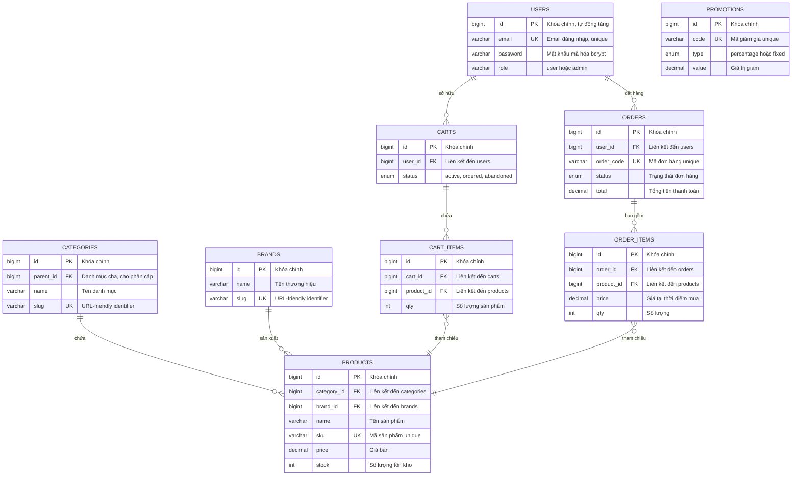

# MÔ HÌNH ERD (Entity Relationship Diagram)

## UITech E-Commerce - Hệ thống bán linh kiện máy tính

---

## Mục Lục

1. [Giới thiệu tổng quan](#1-giới-thiệu-tổng-quan)
2. [Sơ đồ ERD tổng quan](#2-sơ-đồ-erd-tổng-quan)
3. [Giải thích chi tiết từng Entity](#3-giải-thích-chi-tiết-từng-entity)
4. [Giải thích các Relationships](#4-giải-thích-các-relationships)
5. [Luồng dữ liệu trong hệ thống](#5-luồng-dữ-liệu-trong-hệ-thống)

---

## 1. Giới Thiệu Tổng Quan

### 1.1 ERD là gì?

**ERD (Entity Relationship Diagram)** là sơ đồ mô hình hóa dữ liệu, thể hiện:
- **Entities (Thực thể)**: Các đối tượng trong hệ thống (Users, Products, Orders...)
- **Attributes (Thuộc tính)**: Đặc điểm của thực thể (name, email, price...)
- **Relationships (Quan hệ)**: Mối liên kết giữa các thực thể

### 1.2 Hệ thống UITech E-Commerce

Hệ thống bao gồm **24 bảng dữ liệu** chia thành **7 modules**:

| Module | Mô tả | Số bảng |
|--------|-------|---------|
| User Management | Quản lý người dùng, địa chỉ, audit log | 3 |
| Product Catalog | Sản phẩm, danh mục, thương hiệu, specs | 7 |
| Shopping | Giỏ hàng và chi tiết giỏ hàng | 2 |
| Orders | Đơn hàng, chi tiết đơn hàng, đánh giá | 4 |
| Promotions | Mã giảm giá và áp dụng khuyến mãi | 2 |
| PC Builder | Build cấu hình PC | 2 |
| CMS | Trang tĩnh, bài viết, banner, liên hệ | 4 |

---

## 2. Sơ Đồ ERD Tổng Quan

### 2.1 ERD Đơn Giản (Core Entities)

Sơ đồ này thể hiện **9 bảng cốt lõi** của hệ thống với các thuộc tính quan trọng nhất:



### 2.2 Giải thích ký hiệu quan hệ

| Ký hiệu | Ý nghĩa | Ví dụ |
|---------|---------|-------|
| `\|\|--o{` | One-to-Many (1-N) | 1 User có nhiều Orders |
| `}o--\|\|` | Many-to-One (N-1) | Nhiều Order_Items thuộc 1 Product |
| `PK` | Primary Key | id - khóa chính |
| `FK` | Foreign Key | user_id - khóa ngoại |
| `UK` | Unique Key | email - giá trị duy nhất |

---

## 3. Giải Thích Chi Tiết Từng Entity

### 3.1 Module User Management

#### 3.1.1 Bảng USERS (Người dùng)

**Mục đích**: Lưu trữ thông tin tài khoản người dùng.

| Cột | Kiểu | Ràng buộc | Mô tả chi tiết |
|-----|------|-----------|----------------|
| id | BIGINT UNSIGNED | PRIMARY KEY, AUTO_INCREMENT | Định danh duy nhất, tự động tăng |
| name | VARCHAR(255) | NOT NULL | Tên hiển thị của người dùng |
| email | VARCHAR(255) | NOT NULL, UNIQUE | Email đăng nhập, phải unique |
| phone | VARCHAR(255) | NULL | Số điện thoại liên hệ |
| birthday | DATE | NULL | Ngày sinh |
| gender | ENUM('male','female','other') | NULL | Giới tính |
| password | VARCHAR(255) | NOT NULL | Mật khẩu mã hóa bcrypt |
| role | VARCHAR(255) | DEFAULT 'user' | Phân quyền: 'user' hoặc 'admin' |
| email_verified_at | TIMESTAMP | NULL | Thời điểm xác thực email |
| remember_token | VARCHAR(100) | NULL | Token "remember me" |
| created_at | TIMESTAMP | NULL | Thời điểm tạo tài khoản |
| updated_at | TIMESTAMP | NULL | Thời điểm cập nhật gần nhất |

**Indexes**: `idx_role(role)` - Tối ưu query lọc theo role

**Cách hoạt động**:
1. Khi đăng ký: Tạo record mới với role='user', password được hash
2. Khi đăng nhập: So sánh email và verify password hash
3. Admin có role='admin', có quyền truy cập admin panel

#### 3.1.2 Bảng USER_ADDRESSES (Địa chỉ giao hàng)

**Mục đích**: Lưu nhiều địa chỉ giao hàng cho mỗi user.

| Cột | Kiểu | Ràng buộc | Mô tả chi tiết |
|-----|------|-----------|----------------|
| id | BIGINT UNSIGNED | PRIMARY KEY | Định danh duy nhất |
| user_id | BIGINT UNSIGNED | FOREIGN KEY → users.id | Liên kết đến user sở hữu |
| label | VARCHAR(100) | DEFAULT 'Home' | Nhãn: "Nhà", "Văn phòng"... |
| recipient_name | VARCHAR(255) | NOT NULL | Tên người nhận |
| phone | VARCHAR(20) | NOT NULL | SĐT người nhận |
| address_line | TEXT | NOT NULL | Địa chỉ chi tiết |
| is_default | BOOLEAN | DEFAULT 0 | Địa chỉ mặc định khi checkout |

**Quan hệ**: N:1 với USERS (ON DELETE CASCADE)

#### 3.1.3 Bảng AUDIT_LOGS (Nhật ký hoạt động)

**Mục đích**: Ghi lại mọi thao tác CRUD của admin để kiểm soát.

| Cột | Kiểu | Mô tả chi tiết |
|-----|------|----------------|
| id | BIGINT UNSIGNED | Định danh |
| user_id | BIGINT UNSIGNED | Admin thực hiện (FK → users) |
| user_name | VARCHAR(255) | Tên admin (snapshot) |
| action | VARCHAR(50) | create, update, delete |
| model_type | VARCHAR(255) | Class model: "App\Models\Product" |
| model_id | BIGINT UNSIGNED | ID của record bị tác động |
| model_name | VARCHAR(255) | Tên readable: "Intel Core i5" |
| old_values | JSON | Giá trị cũ trước khi thay đổi |
| new_values | JSON | Giá trị mới sau khi thay đổi |
| ip_address | VARCHAR(45) | IP của admin |
| created_at | TIMESTAMP | Thời điểm thực hiện |

**Cách hoạt động**: 
- Mỗi khi admin tạo/sửa/xóa sản phẩm, đơn hàng... hệ thống tự động ghi log
- Cho phép truy vết "Ai đã làm gì, khi nào"

---

### 3.2 Module Product Catalog

#### 3.2.1 Bảng CATEGORIES (Danh mục sản phẩm)

**Mục đích**: Phân loại sản phẩm theo cấu trúc cây (tree structure).

| Cột | Kiểu | Mô tả chi tiết |
|-----|------|----------------|
| id | BIGINT UNSIGNED | Định danh |
| parent_id | BIGINT UNSIGNED | FK → categories.id (self-reference) |
| name | VARCHAR(255) | Tên danh mục |
| slug | VARCHAR(255) | URL slug, unique |
| depth | TINYINT UNSIGNED | Độ sâu: 0=gốc, 1=con, 2=cháu |
| description | TEXT | Mô tả danh mục |
| image | VARCHAR(255) | Ảnh thumbnail |
| sort_order | INT | Thứ tự hiển thị |
| is_active | BOOLEAN | Trạng thái kích hoạt |

**Self-Reference Relationship**: parent_id trỏ về chính bảng categories, cho phép:
```
Linh kiện máy tính (id=1)
├── CPU (id=2, parent_id=1)
├── VGA (id=3, parent_id=1)
└── RAM (id=4, parent_id=1)
    └── RAM DDR5 (id=5, parent_id=4)
```

#### 3.2.2 Bảng BRANDS (Thương hiệu)

**Mục đích**: Quản lý thương hiệu sản phẩm.

| Cột | Kiểu | Mô tả |
|-----|------|-------|
| id | BIGINT UNSIGNED | Định danh |
| name | VARCHAR(100) | Tên thương hiệu: Intel, AMD, NVIDIA |
| slug | VARCHAR(150) | URL slug |
| logo | VARCHAR(255) | Đường dẫn ảnh logo |

#### 3.2.3 Bảng COMPONENT_TYPES (Loại linh kiện)

**Mục đích**: Định nghĩa các loại linh kiện cho Build PC.

| Cột | Kiểu | Mô tả |
|-----|------|-------|
| id | BIGINT UNSIGNED | Định danh |
| name | VARCHAR(100) | Tên: "CPU", "Mainboard", "VGA" |
| code | VARCHAR(50) | Code unique: "cpu", "mainboard", "vga" |
| is_required | BOOLEAN | Bắt buộc trong cấu hình PC |
| sort_order | INT | Thứ tự hiển thị khi build |

**Ví dụ dữ liệu**:
| id | name | code | is_required |
|----|------|------|-------------|
| 1 | CPU | cpu | true |
| 2 | Mainboard | mainboard | true |
| 3 | RAM | ram | true |
| 4 | VGA | vga | true |
| 5 | SSD | ssd | true |
| 6 | Case | case | true |
| 7 | PSU | psu | true |
| 8 | Cooling | cooling | false |

#### 3.2.4 Bảng PRODUCTS (Sản phẩm)

**Mục đích**: Lưu trữ thông tin sản phẩm - bảng quan trọng nhất.

| Cột | Kiểu | Mô tả chi tiết |
|-----|------|----------------|
| id | BIGINT UNSIGNED | Định danh |
| category_id | BIGINT UNSIGNED | FK → categories (bắt buộc) |
| brand_id | BIGINT UNSIGNED | FK → brands (tùy chọn) |
| component_type_id | BIGINT UNSIGNED | FK → component_types (cho linh kiện) |
| tier | TINYINT UNSIGNED | Phân khúc: 1=Entry, 2=Mid, 3=High, 4=Enthusiast |
| name | VARCHAR(255) | Tên sản phẩm |
| slug | VARCHAR(255) | URL slug, unique |
| sku | VARCHAR(255) | Mã sản phẩm, unique |
| description | TEXT | Mô tả chi tiết |
| price | DECIMAL(12,2) | Giá gốc |
| sale_price | DECIMAL(12,2) | Giá khuyến mãi |
| stock | INT | Số lượng tồn kho |
| specifications | JSON | Thông số kỹ thuật dạng JSON |
| image | VARCHAR(255) | Ảnh chính |
| warranty_months | INT | Bảo hành (tháng) |
| is_featured | BOOLEAN | Sản phẩm nổi bật |
| is_active | BOOLEAN | Đang kinh doanh |
| deleted_at | TIMESTAMP | Soft delete |

**JSON specifications ví dụ**:
```json
{
  "socket": "LGA1700",
  "cores": 14,
  "threads": 20,
  "base_clock": "3.4 GHz",
  "boost_clock": "5.6 GHz",
  "tdp": "125W"
}
```

**Tier System cho Build PC**:
- Tier 1 (Entry): Cấu hình entry-level, giá rẻ
- Tier 2 (Mid): Cấu hình tầm trung
- Tier 3 (High): Cấu hình cao cấp
- Tier 4 (Enthusiast): Cấu hình đỉnh cao

#### 3.2.5 Bảng PRODUCT_IMAGES (Ảnh sản phẩm)

**Mục đích**: Lưu nhiều ảnh cho mỗi sản phẩm.

| Cột | Kiểu | Mô tả |
|-----|------|-------|
| id | BIGINT UNSIGNED | Định danh |
| product_id | BIGINT UNSIGNED | FK → products |
| url | VARCHAR(255) | Đường dẫn ảnh |
| is_primary | BOOLEAN | Ảnh chính hiển thị |
| sort_order | SMALLINT UNSIGNED | Thứ tự gallery |

#### 3.2.6 Bảng SPEC_DEFINITIONS (Định nghĩa thông số)

**Mục đích**: Định nghĩa các loại thông số kỹ thuật cho từng component type.

| Cột | Kiểu | Mô tả |
|-----|------|-------|
| id | BIGINT UNSIGNED | Định danh |
| component_type_id | BIGINT UNSIGNED | FK → component_types |
| name | VARCHAR(255) | Tên thông số: "Socket", "Cores" |
| code | VARCHAR(255) | Code unique: "socket", "cores" |
| unit | VARCHAR(255) | Đơn vị: "GHz", "W", "GB" |
| input_type | ENUM | text, number, select, checkbox... |
| is_filterable | BOOLEAN | Có thể lọc theo thông số này |

#### 3.2.7 Bảng PRODUCT_SPECS (Thông số sản phẩm)

**Mục đích**: Lưu giá trị thông số cụ thể cho từng sản phẩm.

| Cột | Kiểu | Mô tả |
|-----|------|-------|
| id | BIGINT UNSIGNED | Định danh |
| product_id | BIGINT UNSIGNED | FK → products |
| spec_definition_id | BIGINT UNSIGNED | FK → spec_definitions |
| value | TEXT | Giá trị: "LGA1700", "14", "125W" |

**Quan hệ 3 chiều**:
```
COMPONENT_TYPES (CPU) → SPEC_DEFINITIONS (socket, cores, tdp)
                              ↓
                        PRODUCT_SPECS (LGA1700, 14, 125W)
                              ↓
                        PRODUCTS (Intel Core i7-14700K)
```

---

### 3.3 Module Shopping

#### 3.3.1 Bảng CARTS (Giỏ hàng)

| Cột | Kiểu | Mô tả |
|-----|------|-------|
| id | BIGINT UNSIGNED | Định danh |
| user_id | BIGINT UNSIGNED | FK → users |
| status | ENUM | 'active', 'ordered', 'abandoned' |
| created_at | TIMESTAMP | Thời điểm tạo giỏ |
| updated_at | TIMESTAMP | Cập nhật gần nhất |

**Trạng thái giỏ hàng**:
- `active`: Đang mua sắm
- `ordered`: Đã checkout thành đơn hàng
- `abandoned`: Bỏ rơi (không hoàn tất checkout)

#### 3.3.2 Bảng CART_ITEMS (Chi tiết giỏ hàng)

| Cột | Kiểu | Mô tả |
|-----|------|-------|
| id | BIGINT UNSIGNED | Định danh |
| cart_id | BIGINT UNSIGNED | FK → carts |
| product_id | BIGINT UNSIGNED | FK → products |
| qty | INT UNSIGNED | Số lượng |
| created_at | TIMESTAMP | Thời điểm thêm |

---

### 3.4 Module Orders

#### 3.4.1 Bảng ORDERS (Đơn hàng)

| Cột | Kiểu | Mô tả chi tiết |
|-----|------|----------------|
| id | BIGINT UNSIGNED | Định danh |
| user_id | BIGINT UNSIGNED | FK → users |
| order_code | VARCHAR(50) | Mã đơn unique: "ORD-20231213-001" |
| status | ENUM | Trạng thái đơn hàng (xem bên dưới) |
| payment_status | ENUM | pending, paid, failed, refunded |
| subtotal | DECIMAL(12,2) | Tạm tính |
| discount | DECIMAL(12,2) | Giảm giá từ coupon |
| shipping_fee | DECIMAL(12,2) | Phí vận chuyển |
| total | DECIMAL(12,2) | Tổng thanh toán |
| shipping_name | VARCHAR(255) | Tên người nhận |
| shipping_address | TEXT | Địa chỉ giao |
| shipping_city | VARCHAR(255) | Thành phố |
| shipping_phone | VARCHAR(255) | SĐT người nhận |
| shipping_method | VARCHAR(255) | standard, express, same_day |
| payment_method | VARCHAR(255) | cod, bank_transfer, atm |
| placed_at | TIMESTAMP | Thời điểm đặt |

**Trạng thái đơn hàng (status)**:
```
pending → processing → picking → shipped → delivered
    ↓                                         ↓
cancelled                                  refunded
```

| Status | Mô tả |
|--------|-------|
| pending | Mới đặt, chờ xác nhận |
| processing | Đang xử lý |
| picking | Đang lấy hàng |
| shipped | Đã giao cho vận chuyển |
| delivered | Giao thành công |
| cancelled | Đã hủy |
| refunded | Đã hoàn tiền |

#### 3.4.2 Bảng ORDER_ITEMS (Chi tiết đơn hàng)

| Cột | Kiểu | Mô tả |
|-----|------|-------|
| id | BIGINT UNSIGNED | Định danh |
| order_id | BIGINT UNSIGNED | FK → orders |
| product_id | BIGINT UNSIGNED | FK → products |
| product_name | VARCHAR(255) | Snapshot tên sản phẩm |
| price | DECIMAL(12,2) | Giá tại thời điểm mua |
| qty | INT | Số lượng |

**Lưu ý quan trọng**: Lưu `price` và `product_name` snapshot vì giá sản phẩm có thể thay đổi sau này.

#### 3.4.3 Bảng PRODUCT_REVIEWS (Đánh giá sản phẩm)

| Cột | Kiểu | Mô tả |
|-----|------|-------|
| id | BIGINT UNSIGNED | Định danh |
| user_id | BIGINT UNSIGNED | FK → users |
| product_id | BIGINT UNSIGNED | FK → products |
| order_id | BIGINT UNSIGNED | FK → orders (optional) |
| rating | TINYINT UNSIGNED | 1-5 sao |
| comment | TEXT | Nội dung đánh giá |
| status | ENUM | pending, approved, rejected |

**Ràng buộc**: Chỉ user đã mua sản phẩm (có order delivered) mới được review.

---

### 3.5 Module Promotions

#### 3.5.1 Bảng PROMOTIONS (Mã giảm giá)

| Cột | Kiểu | Mô tả |
|-----|------|-------|
| id | BIGINT UNSIGNED | Định danh |
| code | VARCHAR(50) | Mã giảm giá unique: "SALE10" |
| name | VARCHAR(255) | Tên chương trình |
| description | TEXT | Mô tả chi tiết |
| type | ENUM | 'percentage' hoặc 'fixed' |
| value | DECIMAL(12,2) | Giá trị: 10 (%) hoặc 50000 (đ) |
| min_order_value | DECIMAL(12,2) | Đơn tối thiểu áp dụng |
| max_discount | DECIMAL(12,2) | Giảm tối đa (cho %) |
| usage_limit | INT | Giới hạn số lần dùng |
| usage_count | INT | Số lần đã dùng |
| starts_at | TIMESTAMP | Bắt đầu hiệu lực |
| expires_at | TIMESTAMP | Hết hạn |
| is_active | BOOLEAN | Trạng thái kích hoạt |

**Ví dụ**:
- SALE10: Giảm 10%, tối đa 200k, đơn từ 500k
- FREESHIP: Giảm 30k cố định, đơn từ 1tr

#### 3.5.2 Bảng ORDER_PROMOTIONS (Áp dụng khuyến mãi)

| Cột | Kiểu | Mô tả |
|-----|------|-------|
| id | BIGINT UNSIGNED | Định danh |
| order_id | BIGINT UNSIGNED | FK → orders |
| promotion_id | BIGINT UNSIGNED | FK → promotions |
| discount_amount | DECIMAL(12,2) | Số tiền thực giảm |

**Đây là bảng trung gian (junction table)** cho quan hệ N:M giữa Orders và Promotions.

---

### 3.6 Module PC Builder

#### 3.6.1 Bảng BUILD_CONFIGS (Cấu hình PC)

| Cột | Kiểu | Mô tả |
|-----|------|-------|
| id | BIGINT UNSIGNED | Định danh |
| user_id | BIGINT UNSIGNED | FK → users (nullable) |
| name | VARCHAR(150) | Tên cấu hình: "Gaming PC RTX 4070" |
| total_price | DECIMAL(15,2) | Tổng giá cấu hình |
| note | TEXT | Ghi chú |

#### 3.6.2 Bảng BUILD_CONFIG_ITEMS (Chi tiết cấu hình)

| Cột | Kiểu | Mô tả |
|-----|------|-------|
| id | BIGINT UNSIGNED | Định danh |
| build_config_id | BIGINT UNSIGNED | FK → build_configs |
| component_type_id | BIGINT UNSIGNED | FK → component_types |
| product_id | BIGINT UNSIGNED | FK → products |
| quantity | INT | Số lượng (thường = 1) |
| unit_price | DECIMAL(15,2) | Giá đơn vị |

---

### 3.7 Module CMS

#### 3.7.1 PAGES, POSTS, BANNERS, CONTACT_MESSAGES, NEWSLETTER_SUBSCRIBERS

Các bảng CMS đơn giản lưu nội dung tĩnh và marketing.

---

## 4. Giải Thích Các Relationships

### 4.1 Quan hệ 1:N (One-to-Many)

| Parent | Child | Ý nghĩa |
|--------|-------|---------|
| users | orders | 1 user có nhiều đơn hàng |
| users | carts | 1 user có nhiều giỏ hàng |
| users | user_addresses | 1 user có nhiều địa chỉ |
| users | product_reviews | 1 user viết nhiều reviews |
| categories | products | 1 danh mục chứa nhiều sản phẩm |
| brands | products | 1 thương hiệu có nhiều sản phẩm |
| products | product_images | 1 sản phẩm có nhiều ảnh |
| products | cart_items | 1 sản phẩm nằm trong nhiều giỏ |
| products | order_items | 1 sản phẩm được bán trong nhiều đơn |
| orders | order_items | 1 đơn hàng có nhiều sản phẩm |
| carts | cart_items | 1 giỏ hàng có nhiều sản phẩm |

### 4.2 Quan hệ N:M (Many-to-Many)

| Bảng 1 | Junction Table | Bảng 2 |
|--------|----------------|--------|
| orders | order_promotions | promotions |
| products | product_specs | spec_definitions |

### 4.3 Self-Reference

| Bảng | Quan hệ |
|------|---------|
| categories | parent_id → categories.id (danh mục cha-con) |

---

## 5. Luồng Dữ Liệu Trong Hệ Thống

### 5.1 Luồng Đăng Ký - Đăng Nhập

```
[User] → POST /register → [Create USERS record] → [Login Session]
                                    ↓
                            password = bcrypt(input)
                            role = 'user'
```

### 5.2 Luồng Mua Hàng

```
1. Browse Products
   [CATEGORIES] → [PRODUCTS] + [PRODUCT_IMAGES] + [BRANDS]
   
2. Add to Cart
   [PRODUCTS] → [CART_ITEMS] ← [CARTS] ← [USERS]
   
3. Checkout
   [CARTS] + [CART_ITEMS] → [ORDERS] + [ORDER_ITEMS]
                                ↓
                    [Apply PROMOTIONS → ORDER_PROMOTIONS]
                    [Update PRODUCTS.stock -= qty]
                    [Update CARTS.status = 'ordered']
   
4. Order Tracking
   [ORDERS.status] → pending → processing → shipped → delivered
   
5. Review
   [ORDERS.status = delivered] → [PRODUCT_REVIEWS]
```

### 5.3 Luồng Build PC

```
1. Select Budget
   [COMPONENT_TYPES] → Filter by tier
   
2. Choose Components
   [PRODUCTS where tier = selected_tier] → [BUILD_CONFIG_ITEMS]
   
3. Save/Order
   [BUILD_CONFIG_ITEMS] → [CARTS] → [ORDERS]
```

---

## Tổng Kết

ERD của UITech E-Commerce thể hiện:

1. **Chuẩn hóa dữ liệu**: Các bảng được thiết kế theo chuẩn 3NF, tránh dư thừa
2. **Tính toàn vẹn**: Foreign keys đảm bảo tham chiếu hợp lệ
3. **Mở rộng**: Cấu trúc linh hoạt cho requirements tương lai
4. **Performance**: Indexes tối ưu cho queries thường dùng
5. **Audit trail**: Theo dõi mọi thay đổi qua audit_logs

---

Cập nhật: 13/12/2025
