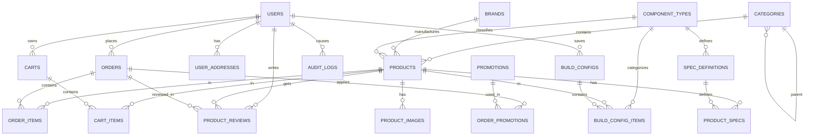

# 📊 Mô Hình ERD (Entity Relationship Diagram)

**UITech - Hệ Thống E-Commerce Bán Linh Kiện Máy Tính**

---

## 🗺️ Sơ Đồ Tổng Quan (Overview)

---

## 📋 Chi Tiết Từng Bảng

### 1️⃣ **USERS** (Người Dùng)
| Trường | Kiểu | Mô Tả |
|--------|------|-------|
| `id` | BIGINT (PK) | Khóa chính |
| `name` | VARCHAR(255) | Tên hiển thị |
| `email` | VARCHAR(255) | Email (unique) |
| `phone` | VARCHAR(255) | Số điện thoại |
| `birthday` | DATE | Ngày sinh |
| `gender` | ENUM | Giới tính (male/female/other) |
| `email_verified_at` | TIMESTAMP | Xác minh email |
| `password` | VARCHAR(255) | Mật khẩu (hash) |
| `role` | VARCHAR(255) | Quyền hạn (user/admin) |
| `remember_token` | VARCHAR(100) | Token nhớ đăng nhập |
| `created_at` | TIMESTAMP | Ngày tạo |
| `updated_at` | TIMESTAMP | Ngày cập nhật |

### 2️⃣ **USER_ADDRESSES** (Địa Chỉ)
| Trường | Kiểu | Mô Tả |
|--------|------|-------|
| `id` | BIGINT (PK) | Khóa chính |
| `user_id` | BIGINT (FK) | Người dùng |
| `label` | VARCHAR(100) | Nhãn (Nhà riêng, Công ty...) |
| `recipient_name` | VARCHAR(255)| Tên người nhận |
| `phone` | VARCHAR(20) | Số điện thoại |
| `address_line` | TEXT | Địa chỉ chi tiết |
| `is_default` | BOOLEAN | Địa chỉ mặc định |

### 3️⃣ **CATEGORIES** (Danh Mục)
| Trường | Kiểu | Mô Tả |
|--------|------|-------|
| `id` | BIGINT (PK) | Khóa chính |
| `parent_id` | BIGINT (FK) | Danh mục cha |
| `name` | VARCHAR(255) | Tên danh mục |
| `slug` | VARCHAR(255) | Slug URL (unique) |
| `depth` | TINYINT | Độ sâu |
| `description` | TEXT | Mô tả |
| `image` | VARCHAR(255) | Hình ảnh |
| `sort_order` | INT | Thứ tự hiển thị |
| `is_active` | BOOLEAN | Trạng thái hiển thị |

### 4️⃣ **BRANDS** (Thương Hiệu)
| Trường | Kiểu | Mô Tả |
|--------|------|-------|
| `id` | BIGINT (PK) | Khóa chính |
| `name` | VARCHAR(100) | Tên thương hiệu |
| `slug` | VARCHAR(150) | Slug URL |
| `logo` | VARCHAR(255) | Logo |

### 5️⃣ **PRODUCTS** (Sản Phẩm)
| Trường | Kiểu | Mô Tả |
|--------|------|-------|
| `id` | BIGINT (PK) | Khóa chính |
| `category_id` | BIGINT (FK) | Danh mục |
| `brand_id` | BIGINT (FK) | Thương hiệu |
| `component_type_id`| BIGINT (FK) | Loại linh kiện |
| `name` | VARCHAR(255) | Tên sản phẩm |
| `slug` | VARCHAR(255) | Slug URL |
| `sku` | VARCHAR(255) | Mã kho (unique) |
| `price` | DECIMAL(12,2) | Giá gốc |
| `sale_price` | DECIMAL(12,2) | Giá khuyến mãi |
| `stock` | INT | Tồn kho |
| `warranty_months` | INT | Bảo hành (tháng) |
| `description` | TEXT | Mô tả |
| `image` | VARCHAR(255) | Ảnh đại diện (legacy) |
| `is_featured` | BOOLEAN | Sản phẩm nổi bật |
| `is_active` | BOOLEAN | Trạng thái kinh doanh |
| `deleted_at` | TIMESTAMP | Soft delete |

### 6️⃣ **PRODUCT_SPECS** (Thông Số Kỹ Thuật)
| Trường | Kiểu | Mô Tả |
|--------|------|-------|
| `id` | BIGINT (PK) | Khóa chính |
| `product_id` | BIGINT (FK) | Sản phẩm |
| `spec_definition_id`| BIGINT (FK)| Định nghĩa thông số |
| `value` | TEXT | Giá trị |

### 7️⃣ **CARTS & CART_ITEMS** (Giỏ Hàng)
**CARTS**:
| Trường | Kiểu | Mô Tả |
|--------|------|-------|
| `id` | BIGINT (PK) | Khóa chính |
| `user_id` | BIGINT (FK) | Người dùng |
| `status` | ENUM | active / ordered |

**CART_ITEMS**:
| Trường | Kiểu | Mô Tả |
|--------|------|-------|
| `id` | BIGINT (PK) | Khóa chính |
| `cart_id` | BIGINT (FK) | Giỏ hàng |
| `product_id` | BIGINT (FK) | Sản phẩm |
| `qty` | INT | Số lượng |
| `price` | DECIMAL | Giá tại thời điểm thêm |

### 8️⃣ **ORDERS** (Đơn Hàng)
| Trường | Kiểu | Mô Tả |
|--------|------|-------|
| `id` | BIGINT (PK) | Khóa chính |
| `user_id` | BIGINT (FK) | Người dùng |
| `order_code` | VARCHAR | Mã đơn hàng |
| `status` | ENUM | pending, paid, picking, shipped, delivered, cancelled, refunded |
| `payment_status` | ENUM | pending, paid, failed, refunded |
| `payment_method` | VARCHAR | Phương thức thanh toán |
| `subtotal` | DECIMAL | Tạm tính |
| `discount` | DECIMAL | Giảm giá |
| `shipping_fee` | DECIMAL | Phí ship |
| `total` | DECIMAL | Tổng tiền |
| `shipping_name` | VARCHAR | Tên người nhận |
| `shipping_phone` | VARCHAR | SĐT người nhận |
| `shipping_address` | TEXT | Địa chỉ giao hàng |
| `shipping_city` | VARCHAR | Thành phố |
| `placed_at` | TIMESTAMP | Thời gian đặt |

### 9️⃣ **PC BUILDER** (Cấu Hình PC)
**COMPONENT_TYPES** (Loại linh kiện - CPU, Mainboard...):
- `id`, `name`, `code`, `is_required`, `sort_order`

**SPEC_DEFINITIONS** (Định nghĩa thông số cho từng loại):
- `id`, `component_type_id`, `name`, `code`, `unit`, `input_type`

**BUILD_CONFIGS** (Cấu hình người dùng lưu):
- `id`, `user_id`, `name`, `total_price`, `note`

**BUILD_CONFIG_ITEMS**:
- `id`, `build_config_id`, `component_type_id`, `product_id`, `quantity`, `unit_price`

### 🔟 **CMS & MARKETING**
**PAGES** (Trang tĩnh):
- `title`, `slug`, `content`, `is_active`

**POSTS** (Tin tức):
- `title`, `slug`, `thumbnail`, `excerpt`, `content`, `is_published`

**BANNERS** (Banner quảng cáo):
- `title`, `image`, `link`, `sort_order`, `is_active`

**CONTACT_MESSAGES** (Liên hệ):
- `name`, `email`, `phone`, `subject`, `message`, `is_read`

**NEWSLETTER_SUBSCRIBERS**:
- `email`, `is_active`

**PROMOTIONS** (Mã giảm giá):
- `code`, `name`, `type` (percentage/fixed), `value`, `min_order_value`, `max_discount`, `usage_limit`, `usage_count`, `starts_at`, `expires_at`

**AUDIT_LOGS** (Lịch sử hoạt động):
- `user_id`, `action`, `model_type`, `model_id`, `old_values`, `new_values`, `description`, `ip_address`

---

## 📈 Data Volume Estimate
| Table | Rows | Note |
|-------|------|------|
| products | ~1,000 | Sản phẩm |
| product_specs | ~20,000 | Thông số kỹ thuật (20 specs/sp) |
| orders | ~5,000 | Đơn hàng/năm |
| audit_logs | ~50,000 | Logs hoạt động |

---

## 📞 Support & Contact

**Document**: `docs/ERD_DIAGRAM.md`  
**Last Updated**: 12/12/2025  
**Database Version**: MySQL 8.0+  
**Application**: Laravel 10.x
