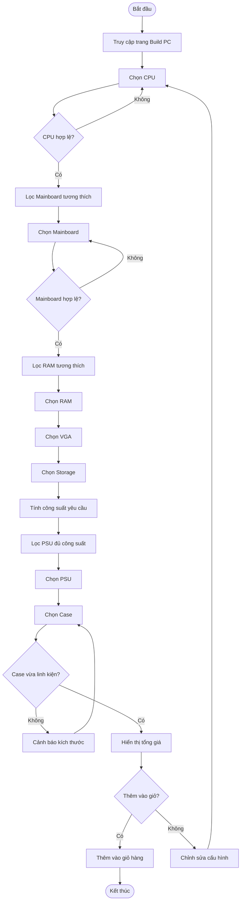
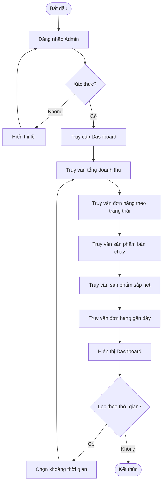
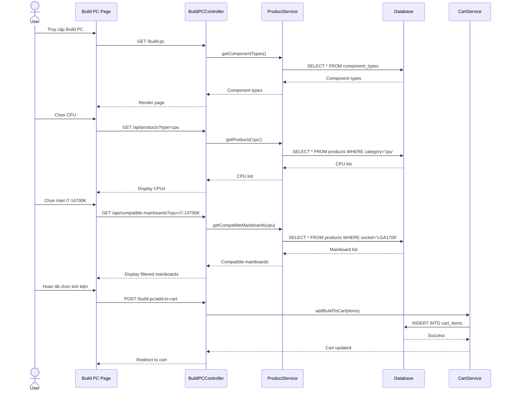
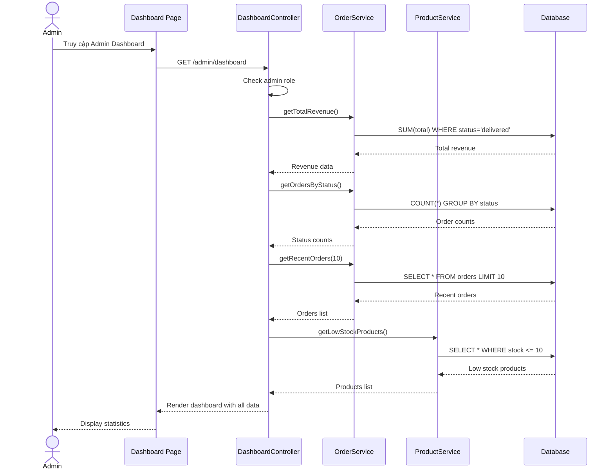

# 📋 BÁO CÁO PHÂN TÍCH VÀ THIẾT KẾ HỆ THỐNG
## UITech - Website Bán Linh Kiện Máy Tính

---

# 2.1. XÁC ĐỊNH YÊU CẦU PHẦN MỀM

## 2.1.1. Yêu cầu chức năng (Functional Requirements)

### 👤 Nhóm 1: Khách hàng vãng lai (Chưa đăng nhập)

| STT | Chức năng | Mô tả chi tiết |
|-----|-----------|----------------|
| F1.1 | Đăng ký tài khoản | Đăng ký bằng Email, mật khẩu, tên |
| F1.2 | Xem danh sách sản phẩm | Xem toàn bộ sản phẩm, phân trang |
| F1.3 | Xem chi tiết sản phẩm | Xem thông số kỹ thuật, giá, ảnh, đánh giá |
| F1.4 | Tìm kiếm sản phẩm | Tìm kiếm theo tên, mã SKU |
| F1.5 | Lọc sản phẩm | Lọc theo danh mục, giá, thương hiệu |
| F1.6 | So sánh sản phẩm | So sánh thông số 2-4 sản phẩm |
| F1.7 | Xem PC Build sẵn | Xem danh sách PC Gaming, Workstation, Office |

---

### 👥 Nhóm 2: Khách hàng đã đăng nhập

| STT | Chức năng | Mô tả chi tiết |
|-----|-----------|----------------|
| F2.1 | Đăng nhập | Đăng nhập bằng Email/Mật khẩu |
| F2.2 | Đăng xuất | Kết thúc phiên đăng nhập |
| F2.3 | Quản lý giỏ hàng | Thêm, sửa số lượng, xóa sản phẩm |
| F2.4 | Thanh toán | Chọn phương thức thanh toán, nhập địa chỉ giao hàng |
| F2.5 | Theo dõi đơn hàng | Xem trạng thái đơn hàng |
| F2.6 | Hủy đơn hàng | Hủy đơn hàng đang chờ xử lý |
| F2.7 | Đặt lại đơn hàng | Mua lại các sản phẩm từ đơn cũ |
| F2.8 | Lắp đặt PC (Build PC) | Chọn linh kiện, hệ thống kiểm tra tương thích |
| F2.9 | Quản lý thông tin cá nhân | Cập nhật họ tên, SĐT, ngày sinh |
| F2.10 | Quản lý địa chỉ | Thêm, sửa, xóa địa chỉ giao hàng |
| F2.11 | Đánh giá sản phẩm | Viết đánh giá sau khi mua hàng |
| F2.12 | Xem lịch sử mua hàng | Xem danh sách đơn hàng đã đặt |

---

### 🛡️ Nhóm 3: Quản trị viên (Admin)

| STT | Chức năng | Mô tả chi tiết |
|-----|-----------|----------------|
| F3.1 | Đăng nhập quản trị | Đăng nhập với quyền admin |
| F3.2 | Quản lý sản phẩm | Thêm, sửa, xóa sản phẩm |
| F3.3 | Quản lý danh mục | Thêm, sửa, xóa danh mục |
| F3.4 | Quản lý đơn hàng | Xem, cập nhật trạng thái đơn |
| F3.5 | Quản lý người dùng | Xem, sửa, xóa tài khoản |
| F3.6 | Quản lý đánh giá | Duyệt, xóa đánh giá |
| F3.7 | Quản lý khuyến mãi | Tạo, sửa, xóa mã giảm giá |
| F3.8 | Thống kê doanh thu | Xem doanh thu, đơn hàng, sản phẩm bán chạy |
| F3.9 | Xem nhật ký hệ thống | Xem audit log hoạt động |
| F3.10 | Quản lý thông số kỹ thuật | Định nghĩa spec cho từng loại linh kiện |

---

## 2.1.2. Yêu cầu phi chức năng (Non-Functional Requirements)

### ⚡ Hiệu năng (Performance)
| Yêu cầu | Mô tả | Thực hiện |
|---------|-------|-----------|
| NF1.1 | Tải trang < 3 giây | ✅ Eager loading, Database indexing |
| NF1.2 | Tối ưu CSDL | ✅ Composite indexes, Query optimization |
| NF1.3 | Caching | ✅ Redis cache for sessions |

### 🎨 UI/UX
| Yêu cầu | Mô tả | Thực hiện |
|---------|-------|-----------|
| NF2.1 | Giao diện thân thiện | ✅ Modern minimalist design |
| NF2.2 | Responsive | ✅ TailwindCSS responsive classes |
| NF2.3 | Quy trình mua hàng tối giản | ✅ Single-page checkout |

### 🔐 Bảo mật (Security)
| Yêu cầu | Mô tả | Thực hiện |
|---------|-------|-----------|
| NF3.1 | Mã hóa mật khẩu | ✅ Bcrypt hashing |
| NF3.2 | Chống SQL Injection | ✅ Eloquent ORM parameterized queries |
| NF3.3 | Chống XSS | ✅ Blade auto-escaping, HttpOnly cookies |
| NF3.4 | CSRF Protection | ✅ Laravel CSRF token |
| NF3.5 | Rate Limiting | ✅ ThrottleRequests middleware |
| NF3.6 | Session Security | ✅ Session invalidation, token regeneration |

### 📈 Khả năng mở rộng (Scalability)
| Yêu cầu | Mô tả | Thực hiện |
|---------|-------|-----------|
| NF4.1 | Thiết kế module hóa | ✅ MVC architecture |
| NF4.2 | API ready | ✅ JSON API endpoints |

### 🔧 Khả năng bảo trì (Maintainability)
| Yêu cầu | Mô tả | Thực hiện |
|---------|-------|-----------|
| NF5.1 | Code chuẩn | ✅ PSR-12 coding standard |
| NF5.2 | Mô hình MVC | ✅ Laravel MVC |
| NF5.3 | Tách biệt Frontend/Backend | ✅ Blade templates + Controllers |

### 🌐 Tính tương thích (Compatibility)
| Yêu cầu | Mô tả | Thực hiện |
|---------|-------|-----------|
| NF6.1 | Chrome, Edge, Firefox | ✅ Tested |
| NF6.2 | Mobile browsers | ✅ Responsive design |

---

# 2.2. MÔ HÌNH HÓA YÊU CẦU

## 2.2.1. Sơ đồ Use-Case (Use-Case Diagram)

### Sơ đồ tổng quát

```mermaid
graph TB
    subgraph Actors
        Guest[👤 Khách vãng lai]
        User[👥 Khách hàng]
        Admin[🛡️ Quản trị viên]
    end
    
    subgraph "Khách vãng lai"
        UC1[Đăng ký tài khoản]
        UC2[Xem sản phẩm]
        UC3[Tìm kiếm sản phẩm]
        UC4[Lọc sản phẩm]
    end
    
    subgraph "Khách hàng"
        UC5[Đăng nhập]
        UC6[Quản lý giỏ hàng]
        UC7[Thanh toán]
        UC8[Theo dõi đơn hàng]
        UC9[Build PC]
        UC10[Quản lý thông tin]
        UC11[Đánh giá sản phẩm]
    end
    
    subgraph "Quản trị viên"
        UC12[Quản lý sản phẩm]
        UC13[Quản lý đơn hàng]
        UC14[Quản lý người dùng]
        UC15[Thống kê doanh thu]
    end
    
    Guest --> UC1
    Guest --> UC2
    Guest --> UC3
    Guest --> UC4
    
    User --> UC5
    User --> UC6
    User --> UC7
    User --> UC8
    User --> UC9
    User --> UC10
    User --> UC11
    
    Admin --> UC12
    Admin --> UC13
    Admin --> UC14
    Admin --> UC15
```



---

### Đặc tả Use-Case chi tiết

#### UC1: Đăng nhập

| Thuộc tính | Mô tả |
|------------|-------|
| **Actor** | Khách hàng, Admin |
| **Mô tả** | Người dùng đăng nhập vào hệ thống |
| **Tiền điều kiện** | Có tài khoản hợp lệ |
| **Hậu điều kiện** | Đăng nhập thành công, chuyển đến trang chủ |

**Luồng chính:**
1. Người dùng truy cập trang đăng nhập
2. Nhập email và mật khẩu
3. Nhấn nút "Đăng nhập"
4. Hệ thống xác thực thông tin
5. Chuyển hướng đến trang chủ

**Luồng thay thế:**
- 4a. Email/mật khẩu sai → Hiển thị thông báo lỗi
- 4b. Tài khoản bị khóa → Hiển thị thông báo

---

#### UC2: Đăng ký tài khoản

| Thuộc tính | Mô tả |
|------------|-------|
| **Actor** | Khách vãng lai |
| **Mô tả** | Đăng ký tài khoản mới |
| **Tiền điều kiện** | Chưa có tài khoản |
| **Hậu điều kiện** | Tài khoản được tạo |

**Luồng chính:**
1. Truy cập trang đăng ký
2. Nhập tên, email, mật khẩu
3. Nhấn "Đăng ký"
4. Hệ thống tạo tài khoản
5. Chuyển hướng đến trang đăng nhập

**Luồng thay thế:**
- 4a. Email đã tồn tại → Thông báo lỗi
- 4b. Mật khẩu yếu → Yêu cầu nhập lại

---

#### UC3: Xem sản phẩm

| Thuộc tính | Mô tả |
|------------|-------|
| **Actor** | Tất cả người dùng |
| **Mô tả** | Xem danh sách và chi tiết sản phẩm |
| **Tiền điều kiện** | Không |
| **Hậu điều kiện** | Hiển thị thông tin sản phẩm |

**Luồng chính:**
1. Truy cập trang sản phẩm
2. Xem danh sách sản phẩm
3. Nhấn vào sản phẩm để xem chi tiết
4. Xem thông số, giá, hình ảnh, đánh giá

---

#### UC4: Mua hàng

| Thuộc tính | Mô tả |
|------------|-------|
| **Actor** | Khách hàng đã đăng nhập |
| **Mô tả** | Thêm sản phẩm vào giỏ và thanh toán |
| **Tiền điều kiện** | Đã đăng nhập |
| **Hậu điều kiện** | Đơn hàng được tạo |

**Luồng 1 - Mua ngay:**
1. Xem chi tiết sản phẩm
2. Chọn số lượng
3. Nhấn "Mua ngay"
4. Nhập thông tin giao hàng
5. Chọn phương thức thanh toán
6. Xác nhận đặt hàng
7. Hệ thống tạo đơn, trừ tồn kho

**Luồng 2 - Mua từ giỏ hàng:**
1. Thêm nhiều sản phẩm vào giỏ
2. Vào giỏ hàng
3. Kiểm tra và điều chỉnh số lượng
4. Nhấn "Thanh toán"
5. (Tiếp tục từ bước 4 Luồng 1)

**Luồng thay thế:**
- 7a. Hết hàng → Thông báo lỗi
- 7b. Thanh toán thất bại → Cho phép thử lại

---

#### UC5: Lắp đặt PC (Build PC)

| Thuộc tính | Mô tả |
|------------|-------|
| **Actor** | Khách hàng đã đăng nhập |
| **Mô tả** | Tự chọn linh kiện để build PC |
| **Tiền điều kiện** | Đã đăng nhập |
| **Hậu điều kiện** | Cấu hình PC được thêm vào giỏ |

**Luồng chính:**
1. Truy cập trang Build PC
2. Chọn CPU
3. Hệ thống lọc Mainboard tương thích
4. Chọn Mainboard
5. Chọn RAM (theo loại DDR của mainboard)
6. Chọn VGA
7. Chọn SSD/HDD
8. Chọn PSU (theo công suất yêu cầu)
9. Chọn Case
10. Xem tổng giá
11. Thêm vào giỏ hàng

**Luồng thay thế:**
- 3a. Không có mainboard tương thích → Thông báo
- 9a. Case không vừa → Cảnh báo

---

#### UC6: Quản lý thông tin tài khoản

| Thuộc tính | Mô tả |
|------------|-------|
| **Actor** | Khách hàng đã đăng nhập |
| **Mô tả** | Cập nhật thông tin cá nhân |
| **Tiền điều kiện** | Đã đăng nhập |
| **Hậu điều kiện** | Thông tin được cập nhật |

**Luồng chính - Sửa thông tin:**
1. Vào trang Profile
2. Chỉnh sửa thông tin
3. Nhấn "Lưu"
4. Hệ thống cập nhật

**Luồng chính - Xóa tài khoản:**
1. Vào trang Profile
2. Nhấn "Xóa tài khoản"
3. Xác nhận mật khẩu
4. Hệ thống xóa tài khoản

---

#### UC7: Xem lịch sử mua hàng và Hủy đơn

| Thuộc tính | Mô tả |
|------------|-------|
| **Actor** | Khách hàng đã đăng nhập |
| **Mô tả** | Xem danh sách đơn hàng, hủy đơn |
| **Tiền điều kiện** | Đã đăng nhập |
| **Hậu điều kiện** | Hiển thị/Hủy đơn hàng |

**Luồng chính - Xem:**
1. Vào trang "Đơn hàng của tôi"
2. Xem danh sách đơn
3. Nhấn đơn để xem chi tiết

**Luồng chính - Hủy:**
1. Xem chi tiết đơn hàng
2. Nhấn "Hủy đơn"
3. Xác nhận hủy
4. Hệ thống cập nhật trạng thái, hoàn lại stock

**Luồng thay thế:**
- 2a. Đơn đã giao → Không thể hủy

---

#### UC8: Quản lý sản phẩm (Admin)

| Thuộc tính | Mô tả |
|------------|-------|
| **Actor** | Quản trị viên |
| **Mô tả** | CRUD sản phẩm |
| **Tiền điều kiện** | Đăng nhập với quyền admin |
| **Hậu điều kiện** | Sản phẩm được cập nhật |

**Luồng chính - Thêm:**
1. Vào Admin > Sản phẩm
2. Nhấn "Thêm mới"
3. Nhập thông tin sản phẩm
4. Upload hình ảnh
5. Nhấn "Lưu"
6. Hệ thống tạo sản phẩm, ghi audit log

**Luồng chính - Sửa:**
1. Tìm sản phẩm
2. Nhấn "Sửa"
3. Chỉnh sửa thông tin
4. Nhấn "Cập nhật"
5. Hệ thống lưu, ghi audit log

**Luồng chính - Xóa:**
1. Tìm sản phẩm
2. Nhấn "Xóa"
3. Xác nhận xóa
4. Hệ thống xóa, ghi audit log với old_values

---

#### UC9: Quản lý đơn hàng (Admin)

| Thuộc tính | Mô tả |
|------------|-------|
| **Actor** | Quản trị viên |
| **Mô tả** | Xem và cập nhật trạng thái đơn |
| **Tiền điều kiện** | Đăng nhập admin |
| **Hậu điều kiện** | Đơn hàng được xử lý |

**Luồng chính:**
1. Vào Admin > Đơn hàng
2. Tìm kiếm/lọc đơn hàng
3. Xem chi tiết đơn
4. Cập nhật trạng thái (pending → processing → shipped → delivered)
5. Hệ thống gửi email thông báo

---

#### UC10: Thống kê doanh thu (Admin)

| Thuộc tính | Mô tả |
|------------|-------|
| **Actor** | Quản trị viên |
| **Mô tả** | Xem báo cáo doanh thu |
| **Tiền điều kiện** | Đăng nhập admin |
| **Hậu điều kiện** | Hiển thị thống kê |

**Luồng chính:**
1. Vào Admin > Dashboard
2. Xem tổng doanh thu (đơn delivered)
3. Xem số đơn hàng theo trạng thái
4. Xem sản phẩm sắp hết hàng
5. Xem đơn hàng gần đây

---

## 2.2.2. Sơ đồ Hoạt động (Activity Diagram)

### Activity Diagram: Lắp đặt PC



---

### Activity Diagram: Thống kê doanh thu



---

## 2.2.3. Sơ đồ Tuần tự (Sequence Diagram)

### Sequence Diagram: Lắp đặt PC



---

### Sequence Diagram: Thống kê doanh thu



---

# 2.3. THIẾT KẾ CƠ SỞ DỮ LIỆU

## 2.3.1. Sơ đồ quan hệ thực thể (ERD)

> Xem chi tiết tại: [ERD_DIAGRAM.md](./ERD_DIAGRAM.md)

```
┌──────────┐     ┌──────────────┐     ┌───────────────┐
│  USERS   │────<│   ORDERS     │────<│ ORDER_ITEMS   │
└──────────┘     └──────────────┘     └───────┬───────┘
     │                                        │
     │           ┌──────────────┐             │
     └──────────<│    CARTS     │             │
                 └──────────────┘             │
                       │                      │
                 ┌─────┴──────┐               │
                 │ CART_ITEMS │───────────────┤
                 └────────────┘               │
                                              │
┌──────────────┐     ┌──────────┐             │
│  CATEGORIES  │────<│ PRODUCTS │<────────────┘
└──────────────┘     └──────────┘
                          │
                    ┌─────┴────────┐
                    │PRODUCT_IMAGES│
                    └──────────────┘
```

---

## 2.3.2. Lược đồ CSDL (Database Schema)

### Mô hình quan hệ:

```
USERS (id, name, email, password, role, phone, birthday, gender, timestamps)

CATEGORIES (id, parent_id→CATEGORIES, name, slug, depth, description, status, timestamps)

PRODUCTS (id, category_id→CATEGORIES, name, slug, sku, description, price, sale_price, stock, brand, status, timestamps)

PRODUCT_IMAGES (id, product_id→PRODUCTS, url, is_primary, sort_order, timestamps)

PRODUCT_SPECS (id, product_id→PRODUCTS, spec_definition_id→SPEC_DEFINITIONS, value, timestamps)

SPEC_DEFINITIONS (id, component_type_id, code, name, unit, data_type, timestamps)

CARTS (id, user_id→USERS, status, timestamps)

CART_ITEMS (id, cart_id→CARTS, product_id→PRODUCTS, price, qty, timestamps)

ORDERS (id, user_id→USERS, order_code, status, payment_method, payment_status, subtotal, discount, shipping_fee, total, shipping_*, timestamps)

ORDER_ITEMS (id, order_id→ORDERS, product_id→PRODUCTS, price, qty, timestamps)

REVIEWS (id, user_id→USERS, product_id→PRODUCTS, rating, comment, status, timestamps)

PROMOTIONS (id, code, name, type, value, min_order_value, max_uses, used_count, timestamps)

AUDIT_LOGS (id, user_id→USERS, action, model_type, model_id, old_values, new_values, ip_address, timestamps)
```

---

## 2.3.3. Đặc tả chi tiết các bảng

### Bảng: USERS
| Trường | Kiểu dữ liệu | Ràng buộc | Mô tả |
|--------|--------------|-----------|-------|
| id | BIGINT UNSIGNED | PK, AUTO_INCREMENT | Khóa chính |
| name | VARCHAR(255) | NOT NULL | Tên người dùng |
| email | VARCHAR(255) | NOT NULL, UNIQUE | Email đăng nhập |
| password | VARCHAR(255) | NOT NULL | Mật khẩu (bcrypt) |
| role | ENUM('user','admin') | DEFAULT 'user' | Vai trò |
| phone | VARCHAR(20) | NULLABLE | Số điện thoại |
| birthday | DATE | NULLABLE | Ngày sinh |
| gender | ENUM('male','female','other') | NULLABLE | Giới tính |
| created_at | TIMESTAMP | | Ngày tạo |
| updated_at | TIMESTAMP | | Ngày cập nhật |

---

### Bảng: PRODUCTS
| Trường | Kiểu dữ liệu | Ràng buộc | Mô tả |
|--------|--------------|-----------|-------|
| id | BIGINT UNSIGNED | PK, AUTO_INCREMENT | Khóa chính |
| category_id | BIGINT UNSIGNED | FK → categories.id | Danh mục |
| name | VARCHAR(255) | NOT NULL | Tên sản phẩm |
| slug | VARCHAR(255) | UNIQUE | URL slug |
| sku | VARCHAR(100) | UNIQUE | Mã SKU |
| description | TEXT | NULLABLE | Mô tả |
| price | DECIMAL(15,2) | NOT NULL | Giá gốc |
| sale_price | DECIMAL(15,2) | NULLABLE | Giá khuyến mãi |
| stock | INT | DEFAULT 0 | Tồn kho |
| brand | VARCHAR(100) | NULLABLE | Thương hiệu |
| status | ENUM('active','inactive') | DEFAULT 'active' | Trạng thái |
| created_at | TIMESTAMP | | Ngày tạo |
| updated_at | TIMESTAMP | | Ngày cập nhật |

---

### Bảng: CARTS
| Trường | Kiểu dữ liệu | Ràng buộc | Mô tả |
|--------|--------------|-----------|-------|
| id | BIGINT UNSIGNED | PK | Khóa chính |
| user_id | BIGINT UNSIGNED | FK → users.id | Người dùng |
| status | ENUM('active','ordered') | DEFAULT 'active' | Trạng thái |
| created_at | TIMESTAMP | | Ngày tạo |
| updated_at | TIMESTAMP | | Ngày cập nhật |

---

### Bảng: CART_ITEMS
| Trường | Kiểu dữ liệu | Ràng buộc | Mô tả |
|--------|--------------|-----------|-------|
| id | BIGINT UNSIGNED | PK | Khóa chính |
| cart_id | BIGINT UNSIGNED | FK → carts.id | Giỏ hàng |
| product_id | BIGINT UNSIGNED | FK → products.id | Sản phẩm |
| price | DECIMAL(15,2) | NOT NULL | Giá lúc thêm |
| qty | INT | NOT NULL, MIN 1 | Số lượng |
| created_at | TIMESTAMP | | Ngày tạo |
| updated_at | TIMESTAMP | | Ngày cập nhật |

**INDEX:** UNIQUE (cart_id, product_id)

---

### Bảng: ORDERS
| Trường | Kiểu dữ liệu | Ràng buộc | Mô tả |
|--------|--------------|-----------|-------|
| id | BIGINT UNSIGNED | PK | Khóa chính |
| user_id | BIGINT UNSIGNED | FK → users.id | Người đặt |
| order_code | VARCHAR(50) | UNIQUE | Mã đơn hàng |
| status | ENUM | DEFAULT 'pending' | pending/processing/shipped/delivered/cancelled |
| payment_method | VARCHAR(50) | | cod/bank_transfer/atm |
| payment_status | ENUM | DEFAULT 'pending' | pending/paid/failed |
| subtotal | DECIMAL(15,2) | | Tổng tiền hàng |
| discount | DECIMAL(15,2) | DEFAULT 0 | Giảm giá |
| shipping_fee | DECIMAL(15,2) | DEFAULT 0 | Phí ship |
| total | DECIMAL(15,2) | | Tổng thanh toán |
| shipping_name | VARCHAR(255) | | Tên người nhận |
| shipping_phone | VARCHAR(20) | | SĐT nhận hàng |
| shipping_address | TEXT | | Địa chỉ |
| shipping_city | VARCHAR(100) | | Tỉnh/Thành |
| placed_at | TIMESTAMP | | Thời gian đặt |
| created_at | TIMESTAMP | | Ngày tạo |
| updated_at | TIMESTAMP | | Ngày cập nhật |

---

### Bảng: ORDER_ITEMS
| Trường | Kiểu dữ liệu | Ràng buộc | Mô tả |
|--------|--------------|-----------|-------|
| id | BIGINT UNSIGNED | PK | Khóa chính |
| order_id | BIGINT UNSIGNED | FK → orders.id | Đơn hàng |
| product_id | BIGINT UNSIGNED | FK → products.id | Sản phẩm |
| price | DECIMAL(15,2) | NOT NULL | Giá lúc mua |
| qty | INT | NOT NULL | Số lượng |
| created_at | TIMESTAMP | | Ngày tạo |
| updated_at | TIMESTAMP | | Ngày cập nhật |

---

### Bảng: CATEGORIES
| Trường | Kiểu dữ liệu | Ràng buộc | Mô tả |
|--------|--------------|-----------|-------|
| id | BIGINT UNSIGNED | PK | Khóa chính |
| parent_id | BIGINT UNSIGNED | FK → categories.id | Danh mục cha |
| name | VARCHAR(255) | NOT NULL | Tên danh mục |
| slug | VARCHAR(255) | UNIQUE | URL slug |
| depth | TINYINT | DEFAULT 0 | Độ sâu |
| description | TEXT | NULLABLE | Mô tả |
| status | BOOLEAN | DEFAULT true | Kích hoạt |
| created_at | TIMESTAMP | | Ngày tạo |
| updated_at | TIMESTAMP | | Ngày cập nhật |

---

### Bảng: REVIEWS
| Trường | Kiểu dữ liệu | Ràng buộc | Mô tả |
|--------|--------------|-----------|-------|
| id | BIGINT UNSIGNED | PK | Khóa chính |
| user_id | BIGINT UNSIGNED | FK → users.id | Người đánh giá |
| product_id | BIGINT UNSIGNED | FK → products.id | Sản phẩm |
| rating | TINYINT | 1-5 | Số sao |
| comment | TEXT | NULLABLE | Nhận xét |
| status | ENUM | DEFAULT 'pending' | pending/approved/rejected |
| created_at | TIMESTAMP | | Ngày tạo |
| updated_at | TIMESTAMP | | Ngày cập nhật |

---

### Bảng: PROMOTIONS
| Trường | Kiểu dữ liệu | Ràng buộc | Mô tả |
|--------|--------------|-----------|-------|
| id | BIGINT UNSIGNED | PK | Khóa chính |
| code | VARCHAR(50) | UNIQUE | Mã giảm giá |
| name | VARCHAR(255) | NOT NULL | Tên khuyến mãi |
| type | ENUM | | percentage/fixed |
| value | DECIMAL(15,2) | | Giá trị giảm |
| min_order_value | DECIMAL(15,2) | NULLABLE | Đơn tối thiểu |
| max_uses | INT | NULLABLE | Lượt sử dụng tối đa |
| used_count | INT | DEFAULT 0 | Đã sử dụng |
| starts_at | TIMESTAMP | | Bắt đầu |
| ends_at | TIMESTAMP | | Kết thúc |
| status | ENUM | | active/inactive |
| created_at | TIMESTAMP | | Ngày tạo |
| updated_at | TIMESTAMP | | Ngày cập nhật |

---

# 2.4. THIẾT KẾ TỔNG THỂ HỆ THỐNG

## Kiến trúc hệ thống: MVC + 3-Tier Architecture

```
┌─────────────────────────────────────────────────────────────────┐
│                     PRESENTATION LAYER                          │
│  ┌─────────────────────────────────────────────────────────┐   │
│  │                    Blade Templates                       │   │
│  │  • layouts/app.blade.php                                │   │
│  │  • components/*.blade.php                               │   │
│  │  • views/*.blade.php                                    │   │
│  └─────────────────────────────────────────────────────────┘   │
│                              │                                  │
│  ┌─────────────────────────────────────────────────────────┐   │
│  │                 TailwindCSS + Alpine.js                  │   │
│  │  • Responsive Design                                    │   │
│  │  • Interactive Components                               │   │
│  └─────────────────────────────────────────────────────────┘   │
└─────────────────────────────────────────────────────────────────┘
                              │
                              ▼
┌─────────────────────────────────────────────────────────────────┐
│                     BUSINESS LOGIC LAYER                        │
│  ┌─────────────────────┐   ┌─────────────────────┐            │
│  │    Controllers      │   │      Services       │            │
│  │  ├─ ProductController│   │  ├─ AuditService    │            │
│  │  ├─ CartController   │   │  └─ ...             │            │
│  │  ├─ OrderController  │   │                     │            │
│  │  ├─ CheckoutController│  └─────────────────────┘            │
│  │  └─ Admin/*          │                                      │
│  └─────────────────────┘                                       │
│                              │                                  │
│  ┌─────────────────────────────────────────────────────────┐   │
│  │                      Middleware                          │   │
│  │  • auth              • admin                            │   │
│  │  • VerifyCsrfToken   • ThrottleRequests                 │   │
│  └─────────────────────────────────────────────────────────┘   │
└─────────────────────────────────────────────────────────────────┘
                              │
                              ▼
┌─────────────────────────────────────────────────────────────────┐
│                      DATA ACCESS LAYER                          │
│  ┌─────────────────────────────────────────────────────────┐   │
│  │              Eloquent ORM Models                         │   │
│  │  ├─ User        ├─ Product      ├─ Order               │   │
│  │  ├─ Cart        ├─ Category     ├─ Review              │   │
│  │  ├─ CartItem    ├─ ProductImage ├─ Promotion           │   │
│  │  └─ OrderItem   └─ AuditLog     └─ ...                 │   │
│  └─────────────────────────────────────────────────────────┘   │
│                              │                                  │
│  ┌─────────────────────────────────────────────────────────┐   │
│  │                    Database                              │   │
│  │                     MySQL 8.0                            │   │
│  └─────────────────────────────────────────────────────────┘   │
└─────────────────────────────────────────────────────────────────┘
```

---

## Technology Stack

| Layer | Technology |
|-------|------------|
| **Frontend** | Blade Templates, TailwindCSS, Alpine.js |
| **Backend** | Laravel 10.x (PHP 8.2) |
| **Database** | MySQL 8.0 |
| **Cache** | Redis |
| **Web Server** | Nginx (Docker) |
| **Containerization** | Docker, Docker Compose |

---

## Cấu trúc thư mục

```
pc-parts-e-store-boilerplate/
├── app/
│   ├── Http/
│   │   ├── Controllers/       # Controllers (User + Admin)
│   │   └── Middleware/        # Auth, Admin, CSRF, etc.
│   ├── Models/                # Eloquent Models
│   └── Services/              # Business Logic Services
├── database/
│   ├── migrations/            # Database migrations
│   └── seeders/               # Data seeders
├── resources/
│   └── views/                 # Blade templates
├── routes/
│   └── web.php               # Web routes
├── public/
│   └── images/               # Static assets
├── docs/                     # Documentation
├── docker/                   # Docker configs
└── docker-compose.yml        # Docker orchestration
```

---

**Ngày cập nhật:** 11/12/2025  
**Phiên bản:** 1.0
