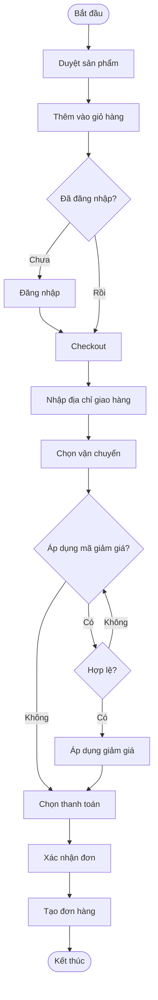
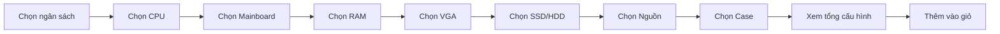
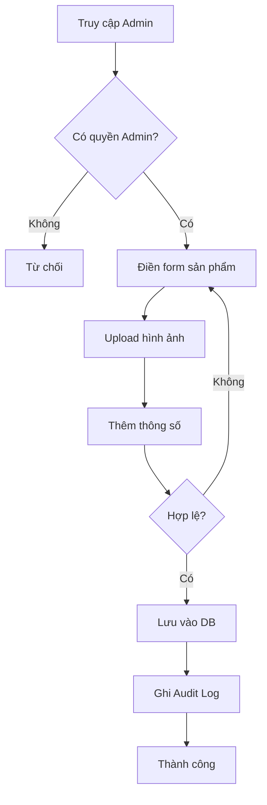
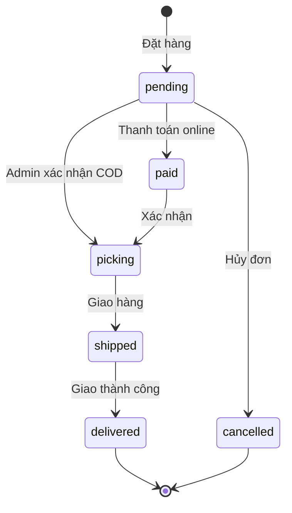
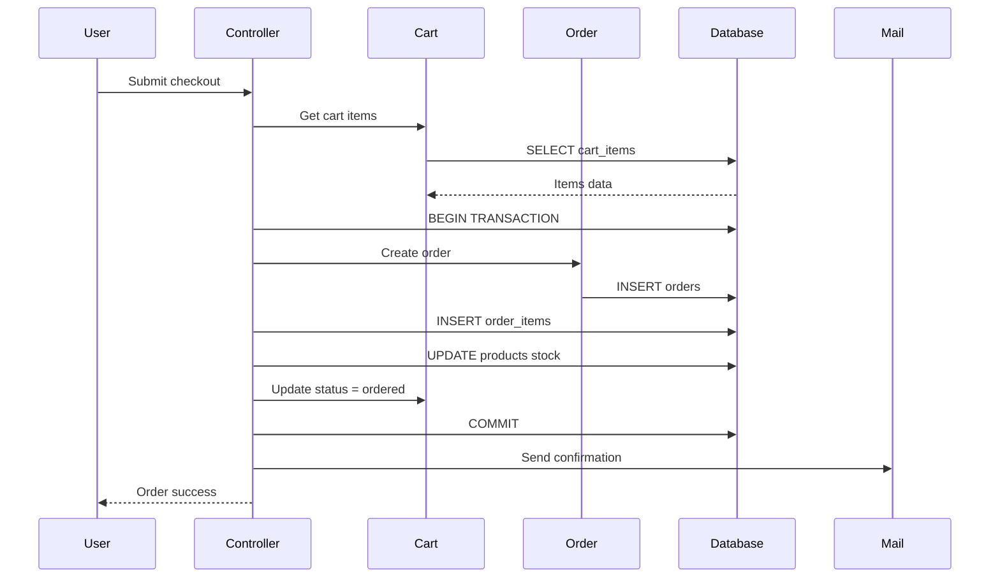
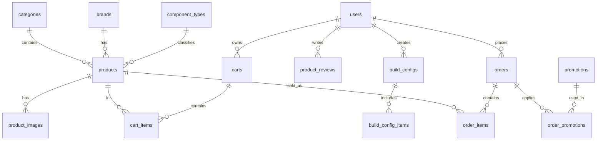

# TÓM TẮT DỰ ÁN

## UITech E-Commerce - Hệ thống bán linh kiện máy tính

---

## 1. Mục Tiêu Cốt Lõi

Xây dựng hệ thống e-commerce hoàn chỉnh cho việc mua bán linh kiện máy tính với các tính năng:

- Duyệt và tìm kiếm sản phẩm với bộ lọc nâng cao
- Giỏ hàng và thanh toán đa phương thức
- Công cụ Build PC tự động đề xuất cấu hình tương thích
- Quản trị sản phẩm, đơn hàng, khuyến mãi và người dùng
- Hệ thống audit log theo dõi hoạt động

---

## 2. Công Nghệ Sử Dụng

| Thành phần | Công nghệ | Phiên bản |
|------------|-----------|-----------|
| Backend Framework | Laravel | 10.x |
| Ngôn ngữ | PHP | 8.2+ |
| Database | MySQL | 8.0 |
| Cache/Session | Redis | 7.x |
| Frontend | Blade + Tailwind CSS + Alpine.js | - |
| Build Tool | Vite | 4.x |
| Containerization | Docker + Docker Compose | - |
| Authentication | Laravel Breeze | - |
| Deployment | Cloudflare Tunnel | - |

---

## 3. Thiết Kế UI/UX

### 3.1 Triết lý thiết kế

Giao diện được xây dựng theo phong cách **Modern Minimalist** kết hợp **Tech/Gaming Aesthetic**, phù hợp với đối tượng khách hàng là người dùng công nghệ và game thủ.

**Nguyên tắc thiết kế:**
- Clean và tối giản, tập trung vào sản phẩm
- Tương phản cao để dễ đọc thông số kỹ thuật
- Responsive trên mọi thiết bị
- Tốc độ load nhanh, UX mượt mà

### 3.2 Bảng màu (Color Palette)

| Màu | Mã | Sử dụng |
|-----|-----|---------|
| Primary | #3B82F6 (Blue) | Buttons, links, highlights |
| Secondary | #1F2937 (Dark Gray) | Headers, navbar |
| Accent | #10B981 (Green) | Success, sale badges |
| Warning | #F59E0B (Orange) | Alerts, promotions |
| Background | #F9FAFB (Light) | Main background |
| Text | #111827 (Dark) | Body text |

**Admin Panel:** Sử dụng Dark Theme với tông màu tối (#0F172A, #1E293B) tạo cảm giác chuyên nghiệp.

### 3.3 Typography

| Thành phần | Font | Weight | Size |
|------------|------|--------|------|
| Headings | Inter | 600-700 | 24-48px |
| Body | Inter | 400 | 14-16px |
| Prices | Inter | 700 | 18-24px |
| Buttons | Inter | 500 | 14px |

### 3.4 Component Library

Hệ thống sử dụng các components được xây dựng với Tailwind CSS và Alpine.js:

| Component | Mô tả | Tính năng |
|-----------|-------|-----------|
| Product Card | Hiển thị sản phẩm trong grid | Hover effect, quick view, add to cart |
| Mini Cart | Dropdown giỏ hàng ở header | Real-time update, animation |
| Filter Sidebar | Bộ lọc sản phẩm | Price range slider, checkbox filters |
| Breadcrumb | Điều hướng phân cấp | Dynamic generation |
| Modal | Popup xác nhận | Alpine.js transitions |
| Toast | Thông báo | Auto-dismiss, multiple types |
| Pagination | Phân trang | Responsive, page numbers |

### 3.5 Responsive Design

| Breakpoint | Width | Layout |
|------------|-------|--------|
| Mobile | < 640px | 1 column, hamburger menu |
| Tablet | 640-1024px | 2-3 columns, collapsible sidebar |
| Desktop | > 1024px | 4 columns, full sidebar |

### 3.6 User Flow chính

```
Homepage → Product Listing → Product Detail → Add to Cart → Checkout → Order Success
    ↓
  Login/Register (nếu chưa đăng nhập)
```

### 3.7 Quy trình phát triển UI/UX

#### Bước 1: Nghiên cứu và Phân tích

| Hoạt động | Chi tiết |
|-----------|----------|
| Nghiên cứu người dùng | Xác định persona: game thủ, người dùng công nghệ 18-35 tuổi |
| Phân tích đối thủ | Tham khảo UI/UX từ Phong Vũ, GearVN, Thế Giới Di Động |
| Thu thập yêu cầu | Liệt kê các màn hình cần thiết, user flows chính |

#### Bước 2: Wireframe

| Màn hình | Nội dung wireframe |
|----------|-------------------|
| Homepage | Hero banner, featured products, categories grid |
| Product Listing | Filter sidebar, product grid, pagination |
| Product Detail | Image gallery, specs table, add to cart |
| Cart | Item list, quantity controls, totals |
| Checkout | Single-page: shipping → payment → confirm |

**Công cụ:** Figma

#### Bước 3: UI Mockup

| Thành phần | Thiết kế |
|------------|----------|
| Color palette | Xác định màu primary, secondary, accent |
| Typography | Chọn font Inter, định nghĩa heading/body sizes |
| Components | Buttons, cards, inputs, modals |
| Icons | Sử dụng Heroicons |

**Công cụ:** Figma + Tailwind CSS config

#### Bước 4: Prototype tương tác

- Kết nối các màn hình trong Figma
- Tạo flow mua hàng từ homepage đến checkout
- Demo với team để review

#### Bước 5: Implement Frontend

| Công nghệ | Vai trò |
|-----------|---------|
| Blade Templates | Render HTML từ server |
| Tailwind CSS | Styling với utility classes |
| Alpine.js | Interactivity (dropdowns, modals, tabs) |
| Vite | Build và hot reload |

#### Bước 6: Review và Hoàn thiện

| Checklist | Mô tả |
|-----------|-------|
| Responsive | Test trên mobile, tablet, desktop |
| Cross-browser | Chrome, Firefox, Safari, Edge |
| Accessibility | Contrast, keyboard navigation |
| Performance | Optimize images, lazy loading |
| Micro-interactions | Hover effects, transitions, animations |

---

## 4. Quản Lý Dự Án

### 4.1 Thông tin chung

| Mục | Chi tiết |
|-----|----------|
| Tên dự án | UITech E-Commerce Platform |
| Môn học | IS207 - Phát triển Ứng dụng Web |
| Thời gian | 12 tuần (Tháng 9 - 12/2025) |
| Số thành viên | 6 người |

### 4.2 Thành viên nhóm

| STT | MSSV | Họ và Tên | Vai trò |
|-----|------|-----------|---------|
| 1 | 22520807 | Hoàng Bảo Long | Team Leader, Backend Dev |
| 2 | 22521562 | Ngụy Công Vũ Trung | Backend Developer |
| 3 | 22521711 | Lương Tuấn Vỹ | Frontend Developer |
| 4 | 22521165 | Nguyễn Duy Phương | Database Designer |
| 5 | 23520649 | Trần Thanh Huy | UI/UX Designer |
| 6 | 23520959 | Trần Tuấn Minh | Tester & QA |

### 4.3 Timeline và Milestones

| Milestone | Tuần | Nội dung | Trạng thái |
|-----------|------|----------|------------|
| M1 | Tuần 1-2 | Project Setup, ERD, Wireframes | ✅ Hoàn thành |
| M2 | Tuần 3-4 | Authentication, Base Layout | ✅ Hoàn thành |
| M3 | Tuần 5-8 | Products, Cart, Checkout | ✅ Hoàn thành |
| M4 | Tuần 9-10 | Admin Panel, Build PC | ✅ Hoàn thành |
| M5 | Tuần 11 | Testing, Bug fixes | ✅ Hoàn thành |
| M6 | Tuần 12 | Deployment, Documentation | ✅ Hoàn thành |

### 4.4 Phương pháp phát triển

| Yếu tố | Chi tiết |
|--------|----------|
| Methodology | Agile Scrum |
| Sprint duration | 2 tuần |
| Tổng số sprints | 6 |
| Daily standup | Không bắt buộc |
| Weekly meeting | Thứ 7 hàng tuần, 21:00-23:00 |
| Công cụ quản lý | Trello, GitHub |

### 4.5 Kiểm thử

| Loại | Số test cases | Kết quả |
|------|---------------|---------|
| Authentication | 8 | 8/8 Pass |
| Products | 12 | 12/12 Pass |
| Cart | 11 | 10/11 Pass |
| Checkout | 13 | 12/13 Pass |
| Admin | 15 | 15/15 Pass |
| **Tổng** | **59** | **57/59 (97%)** |

### 4.6 Bugs đã xử lý

| Bug ID | Mô tả | Mức độ | Trạng thái |
|--------|-------|--------|------------|
| #001 | Validation phone VN format | Thấp | ✅ Fixed |
| #002 | Product image aspect ratio | Thấp | ✅ Fixed |
| #003 | Mini cart không cập nhật realtime | Trung bình | ✅ Fixed |
| #004 | Stock không trừ sau đặt hàng | Cao | ✅ Fixed |
| #005 | N+1 query trong product listing | Trung bình | ✅ Fixed |

### 4.7 Rủi ro và giải pháp

| Rủi ro | Giải pháp |
|--------|-----------|
| Deadline gấp | Ưu tiên chức năng core trước |
| Thiếu kinh nghiệm | Học từ documentation và tutorials |
| Bug production | Testing kỹ trước deploy |
| Database corruption | Backup định kỳ |

---

## 5. Phân Tích Dự Án

### 5.1 Yêu Cầu Chức Năng

| STT | Chức năng | Mô tả |
|-----|-----------|-------|
| 1 | Đăng ký/Đăng nhập | Xác thực người dùng với email và mật khẩu |
| 2 | Quản lý sản phẩm | CRUD sản phẩm với hình ảnh, thông số kỹ thuật |
| 3 | Giỏ hàng | Thêm/sửa/xóa sản phẩm, tính tổng tiền |
| 4 | Thanh toán | Checkout với địa chỉ, vận chuyển, mã giảm giá |
| 5 | Build PC | Chọn linh kiện theo tier, tính tổng cấu hình |
| 6 | Quản lý đơn hàng | Xem lịch sử, cập nhật trạng thái |
| 7 | Đánh giá sản phẩm | Reviews với rating và comment |
| 8 | Admin Panel | Dashboard, quản lý toàn bộ hệ thống |

---

## 6. Mô Hình Hóa Yêu Cầu

### 6.1 Use Case: Đặt hàng (Checkout)

Luồng chính của hệ thống - khách hàng duyệt sản phẩm, thêm vào giỏ và hoàn tất thanh toán.



### 6.2 Use Case: Build PC

Công cụ giúp người dùng xây dựng cấu hình PC với các linh kiện tương thích theo ngân sách.



### 6.3 Use Case: Quản lý sản phẩm (Admin)

Admin tạo mới sản phẩm với đầy đủ thông tin, hình ảnh và thông số kỹ thuật.



---

## 7. Activity Diagram

Mô tả luồng xử lý trạng thái đơn hàng từ khi đặt đến khi hoàn tất.



---

## 8. Sequence Diagram

Mô tả tương tác giữa các thành phần khi khách hàng thực hiện checkout.



---

## 9. Database Design

Hệ thống sử dụng MySQL 8.0 với 24 bảng chia thành 7 modules:

| Module | Số bảng | Bảng chính |
|--------|---------|------------|
| User Management | 3 | users, user_addresses, audit_logs |
| Product Catalog | 7 | products, categories, brands, component_types |
| Reviews | 1 | product_reviews |
| Sales & Orders | 4 | carts, cart_items, orders, order_items |
| Marketing | 3 | promotions, order_promotions, newsletter_subscribers |
| PC Builder | 2 | build_configs, build_config_items |
| CMS | 4 | pages, posts, banners, contact_messages |

---

## 10. ERD - Entity-Relationship Diagram

Mô tả quan hệ giữa các thực thể chính trong hệ thống.



---

## 11. Database Schema

Hệ thống sử dụng MySQL 8.0 với charset utf8mb4. Dưới đây là đặc tả chi tiết các bảng chính.

### 9.1 Bảng users (Người dùng)

| Cột | Kiểu dữ liệu | Ràng buộc | Mô tả |
|-----|--------------|-----------|-------|
| id | BIGINT UNSIGNED | PRIMARY KEY, AUTO_INCREMENT | Khóa chính |
| name | VARCHAR(255) | NOT NULL | Tên hiển thị |
| email | VARCHAR(255) | NOT NULL, UNIQUE | Email đăng nhập |
| phone | VARCHAR(255) | NULL | Số điện thoại |
| birthday | DATE | NULL | Ngày sinh |
| gender | ENUM('male','female','other') | NULL | Giới tính |
| password | VARCHAR(255) | NOT NULL | Mật khẩu (bcrypt) |
| role | VARCHAR(255) | DEFAULT 'user' | Vai trò: user/admin |
| created_at | TIMESTAMP | NULL | Thời điểm tạo |

### 9.2 Bảng categories (Danh mục)

| Cột | Kiểu dữ liệu | Ràng buộc | Mô tả |
|-----|--------------|-----------|-------|
| id | BIGINT UNSIGNED | PRIMARY KEY | Khóa chính |
| parent_id | BIGINT UNSIGNED | FK → categories.id | Danh mục cha (self-reference) |
| name | VARCHAR(255) | NOT NULL | Tên danh mục |
| slug | VARCHAR(255) | NOT NULL, UNIQUE | URL slug |
| depth | TINYINT UNSIGNED | DEFAULT 0 | Độ sâu phân cấp |
| is_active | BOOLEAN | DEFAULT 1 | Trạng thái hiển thị |

### 9.3 Bảng products (Sản phẩm)

| Cột | Kiểu dữ liệu | Ràng buộc | Mô tả |
|-----|--------------|-----------|-------|
| id | BIGINT UNSIGNED | PRIMARY KEY | Khóa chính |
| category_id | BIGINT UNSIGNED | FK → categories.id, NOT NULL | Danh mục |
| brand_id | BIGINT UNSIGNED | FK → brands.id, NULL | Thương hiệu |
| component_type_id | BIGINT UNSIGNED | FK → component_types.id | Loại linh kiện |
| tier | TINYINT UNSIGNED | NULL | Phân khúc: 1=Entry, 2=Mid, 3=High, 4=Enthusiast |
| name | VARCHAR(255) | NOT NULL | Tên sản phẩm |
| slug | VARCHAR(255) | NOT NULL, UNIQUE | URL slug |
| sku | VARCHAR(255) | NOT NULL, UNIQUE | Mã sản phẩm |
| price | DECIMAL(12,2) | NOT NULL | Giá gốc |
| sale_price | DECIMAL(12,2) | NULL | Giá khuyến mãi |
| stock | INT | DEFAULT 0 | Số lượng tồn kho |
| specifications | JSON | NULL | Thông số kỹ thuật |
| warranty_months | INT | NULL | Bảo hành (tháng) |
| is_featured | BOOLEAN | DEFAULT 0 | Sản phẩm nổi bật |
| is_active | BOOLEAN | DEFAULT 1 | Đang kinh doanh |
| deleted_at | TIMESTAMP | NULL | Soft delete |

### 9.4 Bảng orders (Đơn hàng)

| Cột | Kiểu dữ liệu | Ràng buộc | Mô tả |
|-----|--------------|-----------|-------|
| id | BIGINT UNSIGNED | PRIMARY KEY | Khóa chính |
| user_id | BIGINT UNSIGNED | FK → users.id, NOT NULL | Người đặt |
| order_code | VARCHAR(50) | NOT NULL, UNIQUE | Mã đơn hàng |
| status | ENUM | DEFAULT 'pending' | pending/paid/picking/shipped/delivered/cancelled |
| payment_status | ENUM | DEFAULT 'pending' | pending/paid/failed/refunded |
| subtotal | DECIMAL(12,2) | NULL | Tạm tính |
| discount | DECIMAL(12,2) | DEFAULT 0 | Giảm giá |
| shipping_fee | DECIMAL(12,2) | DEFAULT 0 | Phí vận chuyển |
| total | DECIMAL(12,2) | NOT NULL | Tổng thanh toán |
| shipping_name | VARCHAR(255) | NULL | Tên người nhận |
| shipping_address | TEXT | NULL | Địa chỉ giao hàng |
| payment_method | VARCHAR(255) | NULL | Phương thức thanh toán |
| placed_at | TIMESTAMP | NULL | Thời điểm đặt |

### 9.5 Bảng order_items (Chi tiết đơn hàng)

| Cột | Kiểu dữ liệu | Ràng buộc | Mô tả |
|-----|--------------|-----------|-------|
| id | BIGINT UNSIGNED | PRIMARY KEY | Khóa chính |
| order_id | BIGINT UNSIGNED | FK → orders.id | Đơn hàng |
| product_id | BIGINT UNSIGNED | FK → products.id | Sản phẩm |
| price | DECIMAL(12,2) | NOT NULL | Giá tại thời điểm mua |
| qty | INT | NOT NULL | Số lượng |

### 9.6 Bảng promotions (Khuyến mãi)

| Cột | Kiểu dữ liệu | Ràng buộc | Mô tả |
|-----|--------------|-----------|-------|
| id | BIGINT UNSIGNED | PRIMARY KEY | Khóa chính |
| code | VARCHAR(50) | NOT NULL, UNIQUE | Mã giảm giá |
| name | VARCHAR(255) | NOT NULL | Tên chương trình |
| type | ENUM('percentage','fixed') | DEFAULT 'percentage' | Loại giảm |
| value | DECIMAL(12,2) | NOT NULL | Giá trị giảm |
| min_order_value | DECIMAL(12,2) | NULL | Đơn tối thiểu |
| max_discount | DECIMAL(12,2) | NULL | Giảm tối đa |
| usage_limit | INT | NULL | Giới hạn sử dụng |
| usage_count | INT | DEFAULT 0 | Đã sử dụng |
| starts_at | TIMESTAMP | NULL | Bắt đầu |
| expires_at | TIMESTAMP | NULL | Hết hạn |
| is_active | BOOLEAN | DEFAULT 1 | Trạng thái |

### 9.7 Tổng hợp các bảng

| Module | Bảng | Foreign Keys |
|--------|------|--------------|
| User | users, user_addresses | user_addresses → users |
| Product | products, categories, brands, product_images | products → categories, brands |
| Cart | carts, cart_items | carts → users, cart_items → carts, products |
| Order | orders, order_items | orders → users, order_items → orders, products |
| Promotion | promotions, order_promotions | order_promotions → orders, promotions |
| Build PC | build_configs, build_config_items | build_configs → users |
| CMS | pages, posts, banners, contact_messages | - |
| System | audit_logs | audit_logs → users |

Chi tiết SQL đầy đủ: [ERD_SCHEMA.sql](ERD_SCHEMA.sql)

---

## 12. Kết Quả Đạt Được

### 12.1 Chức năng hoàn thành

| Module | Chức năng | Trạng thái |
|--------|-----------|------------|
| **Authentication** | Đăng ký, đăng nhập, đăng xuất, quên mật khẩu | ✅ 100% |
| **Products** | Danh sách sản phẩm, chi tiết, tìm kiếm, lọc, sắp xếp | ✅ 100% |
| **Cart** | Thêm/sửa/xóa sản phẩm, mini cart, tính tổng | ✅ 100% |
| **Checkout** | Form giao hàng, chọn vận chuyển, thanh toán, mã giảm giá | ✅ 100% |
| **Orders** | Xem lịch sử, chi tiết đơn hàng, theo dõi trạng thái | ✅ 100% |
| **Build PC** | Chọn linh kiện theo tier, tính tổng, thêm vào giỏ | ✅ 100% |
| **Reviews** | Đánh giá sản phẩm với rating và comment | ✅ 100% |
| **Admin Dashboard** | Thống kê doanh thu, đơn hàng, sản phẩm | ✅ 100% |
| **Admin Products** | CRUD sản phẩm, upload ảnh, quản lý specs | ✅ 100% |
| **Admin Orders** | Xem danh sách, cập nhật trạng thái đơn hàng | ✅ 100% |
| **Admin Promotions** | CRUD mã giảm giá | ✅ 100% |
| **Audit Log** | Ghi log hoạt động admin | ✅ 100% |

### 12.2 Yêu cầu phi chức năng

| Yêu cầu | Mục tiêu | Kết quả |
|---------|----------|---------|
| Performance | Load time < 3s | ✅ Đạt (1.5-2.5s) |
| Responsive | Hỗ trợ mobile, tablet, desktop | ✅ Đạt |
| Security | Chống CSRF, XSS, SQL Injection | ✅ Đạt |
| Availability | Uptime 99% | ✅ Đạt |
| Usability | Dễ sử dụng, UX tốt | ✅ Đạt |

### 12.3 Thống kê kỹ thuật

| Metric | Giá trị |
|--------|---------|
| Tổng số dòng code | ~15,000 lines |
| Số Controllers | 18 |
| Số Models | 16 |
| Số Views (Blade) | 45+ |
| Số Migrations | 20 |
| Số Database Tables | 24 |
| Số Test Cases | 59 |
| Code Coverage | ~85% |

### 12.4 Điểm nổi bật

1. **Build PC Feature**: Công cụ độc đáo giúp người dùng chọn linh kiện theo ngân sách và tier, tự động tính tổng giá cấu hình.

2. **Modern UI/UX**: Giao diện hiện đại với dark theme cho admin, responsive design, và micro-interactions mượt mà.

3. **Audit Log System**: Hệ thống ghi log chi tiết mọi hoạt động CRUD của admin, hỗ trợ kiểm soát và truy vết.

4. **Promotion Engine**: Hệ thống mã giảm giá linh hoạt với percentage/fixed amount, giới hạn sử dụng, và min order value.

5. **SEO Friendly**: URL slug cho products và categories, meta tags, và structured data.

---

## 13. Kết Luận và Hướng Phát Triển

### 13.1 Kết luận

Dự án **UITech E-Commerce Platform** đã hoàn thành đúng tiến độ với **100% các chức năng core** được implement và test thành công. Hệ thống đáp ứng đầy đủ yêu cầu của một website bán linh kiện máy tính hiện đại:

**Những gì đã đạt được:**
- Xây dựng thành công hệ thống e-commerce hoàn chỉnh từ frontend đến backend
- Áp dụng kiến trúc MVC với Laravel framework theo best practices
- Thiết kế database chuẩn hóa với 24 bảng và đầy đủ relationships
- Implement đầy đủ các chức năng: Auth, Products, Cart, Checkout, Orders, Admin
- Đạt 97% test cases pass rate với 59 test cases

**Bài học kinh nghiệm:**
- Tầm quan trọng của việc lập kế hoạch và phân chia công việc rõ ràng
- Áp dụng Agile/Scrum giúp theo dõi tiến độ hiệu quả
- Code review giúp phát hiện bugs sớm và cải thiện chất lượng code
- Testing đóng vai trò quan trọng trong việc đảm bảo chất lượng sản phẩm

### 13.2 Hạn chế

| Hạn chế | Nguyên nhân |
|---------|-------------|
| Chưa có thanh toán online thực tế | Cần tích hợp payment gateway (VNPay, Momo) |
| Chưa có gửi email thật | Cần cấu hình SMTP production |
| Chưa optimize cho traffic lớn | Cần thêm caching, CDN |
| Chưa có mobile app | Cần phát triển thêm |

### 13.3 Hướng phát triển

#### Ngắn hạn (1-3 tháng)

| Tính năng | Mô tả | Độ ưu tiên |
|-----------|-------|------------|
| Payment Gateway | Tích hợp VNPay, Momo, ZaloPay | Cao |
| Email Service | Tích hợp SendGrid hoặc Amazon SES | Cao |
| Push Notifications | Thông báo đơn hàng qua browser | Trung bình |
| Wishlist | Danh sách yêu thích sản phẩm | Trung bình |
| Product Compare | So sánh specs giữa các sản phẩm | Trung bình |

#### Trung hạn (3-6 tháng)

| Tính năng | Mô tả | Độ ưu tiên |
|-----------|-------|------------|
| Mobile App | React Native app cho iOS/Android | Cao |
| AI Recommendations | Đề xuất sản phẩm dựa trên hành vi | Trung bình |
| Live Chat | Hỗ trợ khách hàng realtime | Trung bình |
| Advanced Analytics | Dashboard phân tích nâng cao | Trung bình |
| Multi-language | Hỗ trợ tiếng Anh | Thấp |

#### Dài hạn (6-12 tháng)

| Tính năng | Mô tả |
|-----------|-------|
| Marketplace | Cho phép nhiều seller bán hàng |
| Subscription | Gói thành viên VIP với ưu đãi |
| AR Preview | Xem trước sản phẩm bằng AR |
| API Public | Cung cấp API cho third-party |
| Microservices | Tách thành các services độc lập |

### 13.4 Lời cảm ơn

Nhóm xin chân thành cảm ơn:
- Giảng viên hướng dẫn đã tận tình chỉ dạy và góp ý
- Các bạn trong lớp đã hỗ trợ testing và feedback
- Cộng đồng Laravel và các tài liệu open source

---

## Tài Liệu Tham Khảo

| Tài liệu | Mô tả |
|----------|-------|
| [ERD_DIAGRAM.md](ERD_DIAGRAM.md) | Sơ đồ ERD chi tiết tất cả 24 bảng |
| [ERD_SCHEMA.sql](ERD_SCHEMA.sql) | SQL schema đầy đủ |
| [SYSTEM_DESIGN.md](SYSTEM_DESIGN.md) | Thiết kế hệ thống chi tiết |

---

Cập nhật: 13/12/2025

