# THIẾT KẾ HỆ THỐNG

## UITech E-Commerce - Hệ thống bán linh kiện máy tính

---

## Mục Lục

1. [Tổng quan hệ thống](#1-tổng-quan-hệ-thống)
2. [Kiến trúc hệ thống](#2-kiến-trúc-hệ-thống)
3. [Cách hệ thống hoạt động](#3-cách-hệ-thống-hoạt-động)
4. [Activity Diagrams](#4-activity-diagrams)
5. [Sequence Diagrams](#5-sequence-diagrams)
6. [Tổng kết cơ chế hoạt động](#6-tổng-kết-cơ-chế-hoạt-động)

---

## 1. Tổng Quan Hệ Thống

### 1.1 Mô tả dự án

**UITech E-Commerce** là hệ thống thương mại điện tử chuyên bán linh kiện máy tính, PC Gaming và thiết bị công nghệ. 

**Mục đích hoạt động**: Cung cấp nền tảng mua sắm trực tuyến cho khách hàng muốn mua linh kiện máy tính lẻ hoặc xây dựng cấu hình PC hoàn chỉnh.

### 1.2 Hai nhóm người dùng

| Vai trò | Chức năng chính | Trang truy cập |
|---------|-----------------|----------------|
| **Khách hàng (User)** | Duyệt sản phẩm, mua hàng, build PC, đánh giá | `/`, `/products`, `/cart`, `/checkout` |
| **Quản trị viên (Admin)** | Quản lý sản phẩm, đơn hàng, khuyến mãi, audit | `/admin/*` |

### 1.3 Công nghệ sử dụng

| Thành phần | Công nghệ | Vai trò trong hệ thống |
|------------|-----------|------------------------|
| **Backend Framework** | Laravel 10.x | Xử lý logic nghiệp vụ, routing, authentication |
| **Ngôn ngữ** | PHP 8.2+ | Ngôn ngữ chính của backend |
| **Database** | MySQL 8.0 | Lưu trữ dữ liệu chính |
| **Cache/Session** | Redis 7.x | Lưu session, cache queries |
| **Frontend** | Blade + Tailwind CSS + Alpine.js | Render HTML, styling, interactivity |
| **Build Tool** | Vite 4.x | Compile CSS/JS, hot reload |
| **Containerization** | Docker + Docker Compose | Môi trường development đồng nhất |
| **Authentication** | Laravel Breeze | Hệ thống đăng nhập/đăng ký |

**Giải thích lựa chọn công nghệ**:

1. **Laravel**: Framework PHP phổ biến nhất, có Eloquent ORM mạnh mẽ, Blade templating dễ dùng, cộng đồng lớn.

2. **Tailwind CSS**: Utility-first CSS framework, cho phép style trực tiếp trong HTML, không cần viết CSS riêng, tối ưu bundle size.

3. **Alpine.js**: JavaScript nhỏ gọn (15KB), thêm interactivity mà không cần Vue/React, hoạt động trực tiếp với Blade.

4. **Redis**: In-memory store cho session và cache, giảm tải database queries.

5. **Docker**: Đóng gói toàn bộ môi trường, đảm bảo chạy giống nhau trên mọi máy.

---

## 2. Kiến Trúc Hệ Thống

### 2.1 Mô Hình MVC (Model-View-Controller)

**MVC là gì?**

MVC là pattern chia ứng dụng thành 3 thành phần:
- **Model**: Xử lý dữ liệu và business logic
- **View**: Hiển thị giao diện người dùng
- **Controller**: Điều phối giữa Model và View

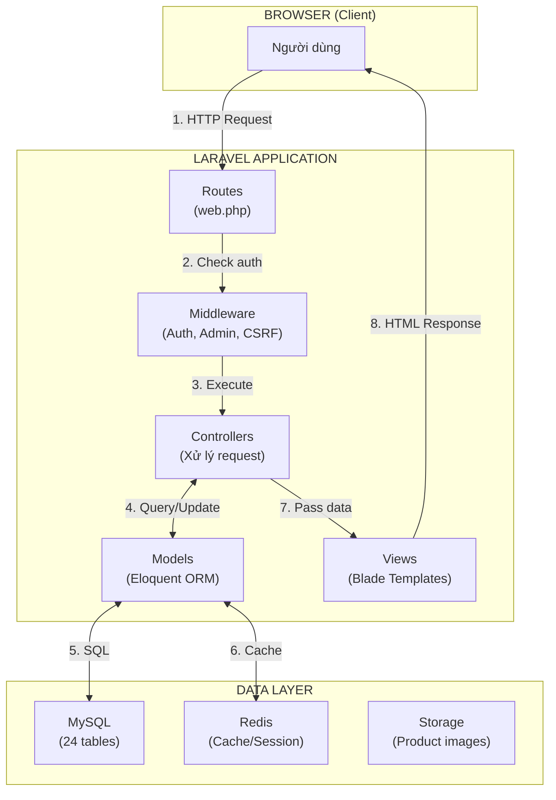

**Giải thích luồng hoạt động**:

1. **HTTP Request**: User click link hoặc submit form, trình duyệt gửi request đến server

2. **Routes (web.php)**: Laravel match URL với route tương ứng
   ```php
   Route::get('/products/{product}', [ProductController::class, 'show']);
   ```

3. **Middleware**: Kiểm tra các điều kiện trước khi chạy controller
   - `auth`: Yêu cầu đăng nhập
   - `admin`: Yêu cầu role admin
   - `csrf`: Bảo vệ chống tấn công CSRF

4. **Controller**: Xử lý logic nghiệp vụ
   ```php
   public function show(Product $product)
   {
       return view('products.show', compact('product'));
   }
   ```

5. **Model (Eloquent ORM)**: Tương tác với database qua object
   ```php
   $product = Product::with('images', 'category', 'brand')->find($id);
   ```

6. **SQL Query**: Eloquent chuyển đổi thành SQL
   ```sql
   SELECT * FROM products WHERE id = ? AND deleted_at IS NULL
   ```

7. **View (Blade)**: Render HTML với data
   ```blade
   <h1>{{ $product->name }}</h1>
   <p>Giá: {{ number_format($product->price) }}đ</p>
   ```

8. **HTTP Response**: HTML được gửi về trình duyệt

---

### 2.2 Kiến Trúc 3 Tầng (3-Tier Architecture)

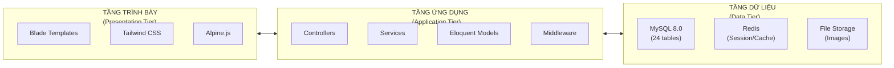

**Giải thích chi tiết từng tầng**:

#### Tầng 1: Presentation (Trình bày)

| Thành phần | Chức năng | Ví dụ |
|------------|-----------|-------|
| **Blade Templates** | Render HTML với syntax PHP đơn giản | `{{ $product->name }}`, `@foreach`, `@if` |
| **Tailwind CSS** | Styling với utility classes | `class="bg-blue-500 text-white p-4"` |
| **Alpine.js** | Interactivity nhỏ gọn | Dropdown menu, modal, toggle, tabs |

**Ưu điểm**:
- Blade: Syntax quen thuộc với PHP developers
- Tailwind: Không cần rời khỏi HTML để style
- Alpine: Không cần build step, hoạt động ngay trong browser

#### Tầng 2: Application (Ứng dụng)

| Thành phần | Chức năng | Ví dụ |
|------------|-----------|-------|
| **Controllers** | Xử lý requests, điều phối logic | `ProductController`, `OrderController` |
| **Services** | Business logic phức tạp, tái sử dụng | `AuditService` ghi log hoạt động |
| **Models** | ORM mapping với database | `Product::where('is_active', true)->get()` |
| **Middleware** | Filter requests | `->middleware('auth')`, `->middleware('admin')` |

**Eloquent ORM hoạt động thế nào**:

```php
// PHP Code
$products = Product::where('category_id', 1)
    ->where('is_active', true)
    ->with('images')
    ->orderBy('price', 'desc')
    ->paginate(12);

// Eloquent tự động chuyển thành SQL:
SELECT * FROM products 
WHERE category_id = 1 AND is_active = 1 AND deleted_at IS NULL
ORDER BY price DESC
LIMIT 12 OFFSET 0
```

#### Tầng 3: Data (Dữ liệu)

| Thành phần | Chức năng | Cấu hình |
|------------|-----------|----------|
| **MySQL 8.0** | Lưu trữ chính | 24 tables, InnoDB engine, utf8mb4 charset |
| **Redis** | Cache và Session | Session driver, query cache |
| **File Storage** | Lưu ảnh sản phẩm | `storage/app/public/images/products/` |

---

### 2.3 Cấu Trúc Thư Mục Project

```
pc-parts-e-store-boilerplate/
├── app/                           # Code PHP chính
│   ├── Http/
│   │   ├── Controllers/           # Xử lý HTTP requests
│   │   │   ├── Admin/             # Controllers cho admin panel
│   │   │   │   ├── DashboardController.php
│   │   │   │   ├── ProductController.php
│   │   │   │   ├── OrderController.php
│   │   │   │   ├── UserController.php
│   │   │   │   ├── PromotionController.php
│   │   │   │   ├── ReviewController.php
│   │   │   │   └── AuditLogController.php
│   │   │   ├── Auth/              # Controllers cho authentication
│   │   │   ├── CartController.php
│   │   │   ├── CheckoutController.php
│   │   │   ├── OrderController.php
│   │   │   ├── ProductController.php
│   │   │   ├── ReviewController.php
│   │   │   └── ProfileController.php
│   │   └── Middleware/
│   │       └── AdminMiddleware.php    # Kiểm tra quyền admin
│   ├── Models/                    # Eloquent Models
│   │   ├── User.php
│   │   ├── Product.php
│   │   ├── Order.php
│   │   ├── Category.php
│   │   ├── Cart.php
│   │   ├── Promotion.php
│   │   ├── ProductReview.php
│   │   └── AuditLog.php
│   ├── Services/
│   │   └── AuditService.php       # Service ghi audit log
│   └── Providers/
│
├── database/
│   ├── migrations/                # Định nghĩa cấu trúc database
│   └── seeders/                   # Seed data mẫu
│
├── resources/
│   └── views/                     # Blade templates
│       ├── admin/                 # Views cho admin panel
│       ├── checkout/              # Views checkout flow
│       ├── orders/                # Views đơn hàng
│       ├── products/              # Views sản phẩm
│       ├── cart/                  # Views giỏ hàng
│       ├── layouts/               # Layout chung (header, footer)
│       └── components/            # Blade components tái sử dụng
│
├── routes/
│   ├── web.php                    # Routes cho web
│   └── auth.php                   # Routes cho authentication
│
├── public/
│   └── images/products/           # Ảnh sản phẩm
│
└── docker-compose.yml             # Docker configuration
```

---

### 2.4 Request Lifecycle (Vòng đời một Request)

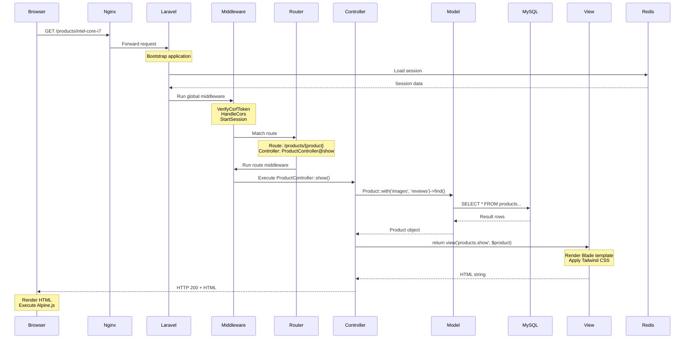

**Giải thích từng bước**:

| Bước | Thành phần | Hoạt động |
|------|------------|-----------|
| 1 | Browser → Nginx | Request HTTP được gửi đến web server |
| 2 | Nginx → Laravel | Nginx forward request tới PHP-FPM chạy Laravel |
| 3 | Laravel → Redis | Khôi phục session của user từ Redis |
| 4 | Global Middleware | Kiểm tra CSRF token, xử lý CORS |
| 5 | Router | Match URL `/products/intel-core-i7` với route pattern |
| 6 | Route Middleware | Chạy middleware của route (nếu có) |
| 7 | Controller | Execute method `show()` của `ProductController` |
| 8 | Model → MySQL | Eloquent query lấy product và relationships |
| 9 | View | Blade render HTML với data từ controller |
| 10 | Response | HTML được gửi về browser |
| 11 | Browser | Render HTML, chạy Alpine.js cho interactivity |

---

## 3. Cách Hệ Thống Hoạt Động

### 3.1 Luồng Đăng Ký / Đăng Nhập

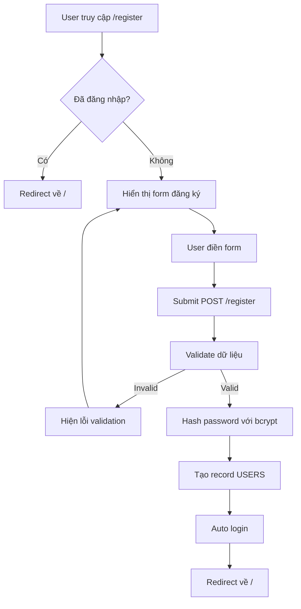

**Chi tiết xử lý**:

```php
// RegisteredUserController.php
public function store(Request $request)
{
    // Bước 1: Validate
    $request->validate([
        'name' => ['required', 'string', 'max:255'],
        'email' => ['required', 'string', 'email', 'unique:users'],
        'password' => ['required', 'confirmed', Rules\Password::defaults()],
    ]);

    // Bước 2: Tạo user với password đã hash
    $user = User::create([
        'name' => $request->name,
        'email' => $request->email,
        'password' => Hash::make($request->password), // Mã hóa bcrypt
        'role' => 'user', // Mặc định role user
    ]);

    // Bước 3: Kích hoạt session
    Auth::login($user);

    return redirect('/');
}
```

---

### 3.2 Luồng Xem Sản Phẩm

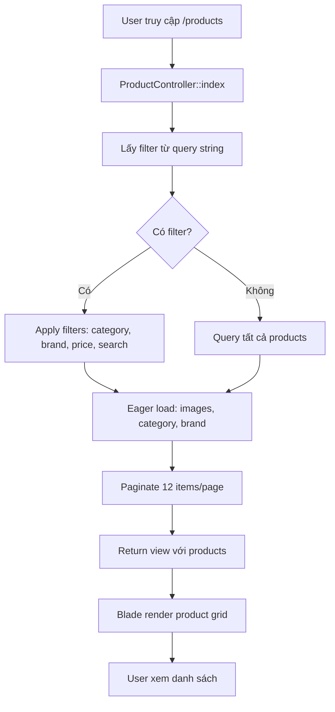

**Query với Filter**:

```php
// ProductController.php
public function index(Request $request)
{
    $query = Product::query()
        ->with(['images', 'category', 'brand']) // Eager loading
        ->where('is_active', true);

    // Filter theo category
    if ($request->category) {
        $query->whereHas('category', function($q) use ($request) {
            $q->where('slug', $request->category);
        });
    }

    // Filter theo khoảng giá
    if ($request->min_price) {
        $query->where('price', '>=', $request->min_price);
    }
    if ($request->max_price) {
        $query->where('price', '<=', $request->max_price);
    }

    // Tìm kiếm
    if ($request->search) {
        $query->where('name', 'like', "%{$request->search}%");
    }

    // Sắp xếp
    $query->orderBy($request->sort ?? 'created_at', $request->order ?? 'desc');

    $products = $query->paginate(12);

    return view('products.index', compact('products'));
}
```

---

### 3.3 Luồng Mua Hàng (Add to Cart → Checkout → Order)

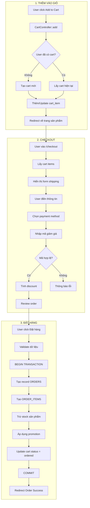

**Chi tiết code xử lý checkout**:

```php
// CheckoutController.php
public function placeOrder(Request $request)
{
    DB::beginTransaction();
    try {
        $cart = Cart::with('items.product')->where('user_id', auth()->id())->first();
        
        // 1. Tạo order
        $order = Order::create([
            'user_id' => auth()->id(),
            'order_code' => 'ORD-' . date('Ymd') . '-' . str_pad(Order::count() + 1, 4, '0', STR_PAD_LEFT),
            'status' => 'pending',
            'payment_status' => 'pending',
            'subtotal' => $cart->items->sum(fn($item) => $item->price * $item->qty),
            'shipping_fee' => $request->shipping_fee,
            'discount' => $request->discount ?? 0,
            'total' => $total,
            'shipping_name' => $request->shipping_name,
            'shipping_phone' => $request->shipping_phone,
            'shipping_address' => $request->shipping_address,
            'payment_method' => $request->payment_method,
            'placed_at' => now(),
        ]);

        // 2. Tạo order items + trừ stock
        foreach ($cart->items as $item) {
            OrderItem::create([
                'order_id' => $order->id,
                'product_id' => $item->product_id,
                'product_name' => $item->product->name,
                'price' => $item->price,
                'qty' => $item->qty,
            ]);

            $item->product->decrement('stock', $item->qty);
        }

        // 3. Áp dụng promotion
        if ($request->promotion_id) {
            OrderPromotion::create([
                'order_id' => $order->id,
                'promotion_id' => $request->promotion_id,
                'discount_amount' => $request->discount,
            ]);
            Promotion::find($request->promotion_id)->increment('usage_count');
        }

        // 4. Update cart status
        $cart->update(['status' => 'ordered']);

        DB::commit();
        return redirect()->route('orders.show', $order);

    } catch (\Exception $e) {
        DB::rollback();
        return back()->with('error', 'Đặt hàng thất bại!');
    }
}
```

---

### 3.4 Luồng Admin Quản Lý Sản Phẩm

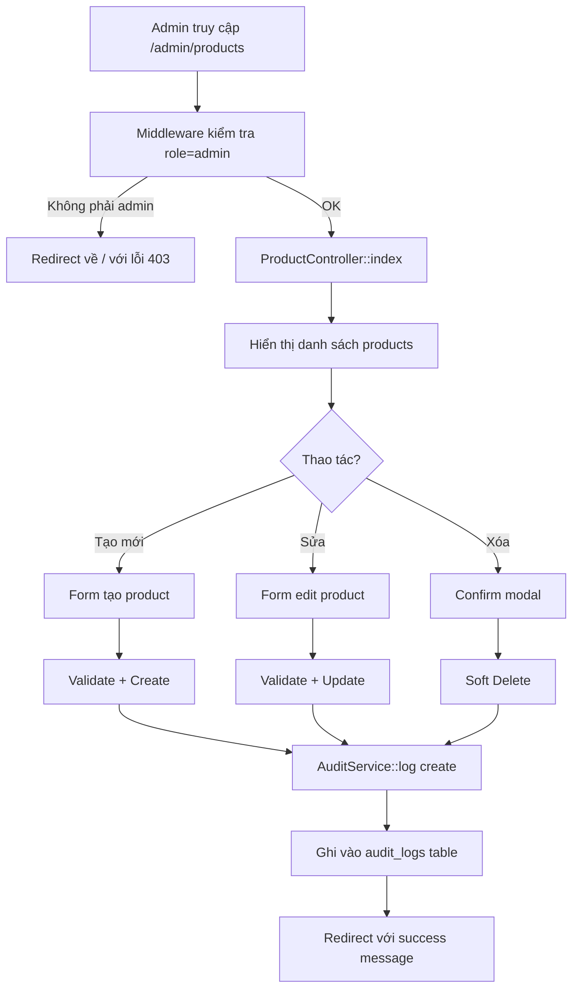

**Audit Log hoạt động**:

```php
// AuditService.php
class AuditService
{
    public static function log(string $action, Model $model, ?array $oldValues = null): void
    {
        AuditLog::create([
            'user_id' => auth()->id(),
            'user_name' => auth()->user()->name,
            'action' => $action, // 'create', 'update', 'delete'
            'model_type' => get_class($model),
            'model_id' => $model->id,
            'model_name' => $model->name ?? $model->title ?? "#{$model->id}",
            'old_values' => $oldValues ? json_encode($oldValues) : null,
            'new_values' => json_encode($model->toArray()),
            'ip_address' => request()->ip(),
        ]);
    }
}

// Sử dụng trong controller
public function store(Request $request)
{
    $product = Product::create($validated);
    AuditService::log('create', $product);
    return redirect()->route('admin.products.index');
}
```

---

## 4. Activity Diagrams

### 4.1 Activity Diagram: Xử Lý Trạng Thái Đơn Hàng

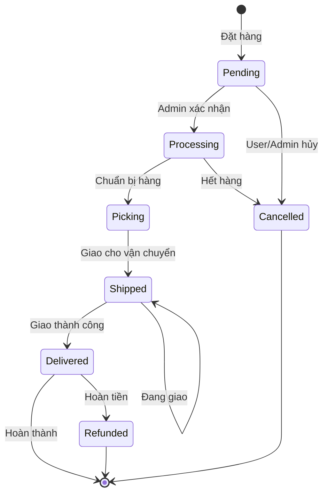

**Giải thích từng trạng thái**:

| Trạng thái | Mô tả | Cho phép chuyển sang |
|------------|-------|---------------------|
| **pending** | Đơn hàng mới đặt, chờ xác nhận | processing, cancelled |
| **processing** | Đã xác nhận, đang xử lý | picking, cancelled |
| **picking** | Đang lấy hàng từ kho | shipped |
| **shipped** | Đã giao cho đơn vị vận chuyển | delivered |
| **delivered** | Giao hàng thành công | refunded, (end) |
| **cancelled** | Đơn hàng bị hủy | (end) |
| **refunded** | Đã hoàn tiền | (end) |

---

### 4.2 Activity Diagram: Build PC

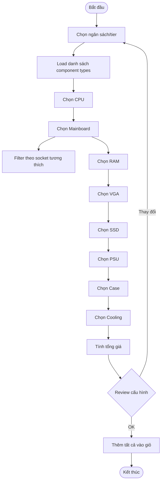

---

## 5. Sequence Diagrams

### 5.1 Sequence Diagram: Checkout Flow

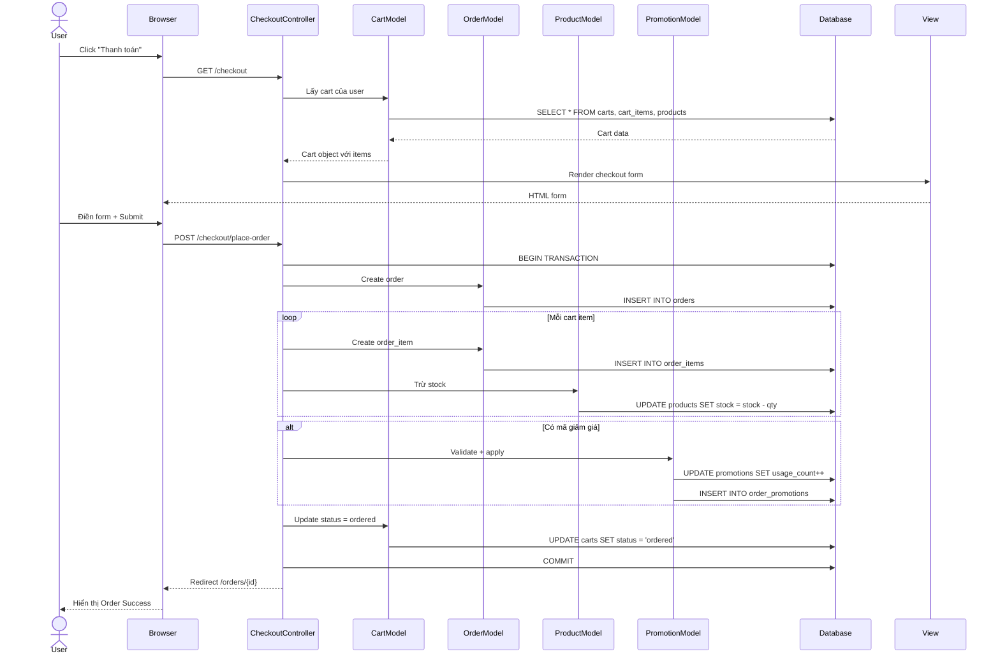

---

### 5.2 Sequence Diagram: Product Review

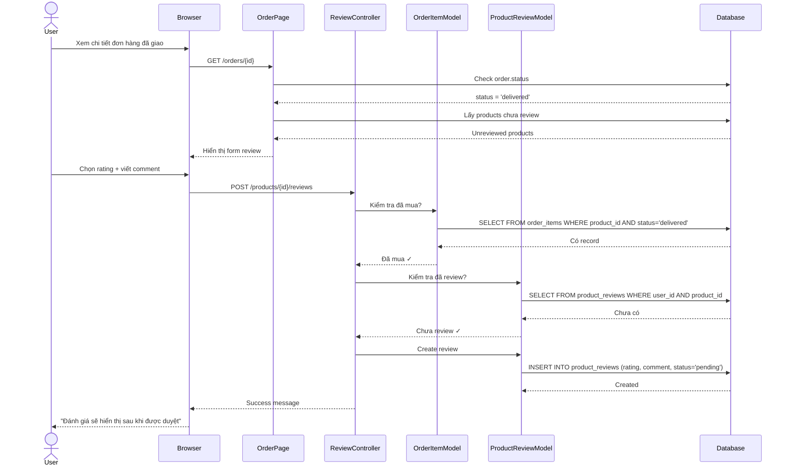

---

## 6. Tổng Kết Cơ Chế Hoạt Động

### 6.1 Tổng quan Flow chính

```
┌─────────────────────────────────────────────────────────────────────────┐
│                           UITech E-Commerce                              │
├─────────────────────────────────────────────────────────────────────────┤
│                                                                          │
│  ┌──────────┐    ┌──────────┐    ┌──────────┐    ┌──────────┐          │
│  │  Browse  │ →  │   Add    │ →  │ Checkout │ →  │  Order   │          │
│  │ Products │    │ to Cart  │    │          │    │ Tracking │          │
│  └──────────┘    └──────────┘    └──────────┘    └──────────┘          │
│       ↓               ↓               ↓               ↓                 │
│  ┌──────────┐    ┌──────────┐    ┌──────────┐    ┌──────────┐          │
│  │ PRODUCTS │    │ CARTS    │    │ ORDERS   │    │ REVIEWS  │          │
│  │ Table    │    │ Table    │    │ Table    │    │ Table    │          │
│  └──────────┘    └──────────┘    └──────────┘    └──────────┘          │
│                                                                          │
└─────────────────────────────────────────────────────────────────────────┘
```

### 6.2 Các cơ chế bảo mật

| Cơ chế | Implementation | Mục đích |
|--------|----------------|----------|
| **Authentication** | Laravel Breeze + Session | Xác thực người dùng |
| **Authorization** | AdminMiddleware | Phân quyền admin/user |
| **CSRF Protection** | `@csrf` token trong form | Chống tấn công CSRF |
| **Password Hashing** | bcrypt với cost 12 | Bảo mật mật khẩu |
| **SQL Injection** | Eloquent ORM + Prepared statements | Chống SQL injection |
| **XSS Protection** | Blade `{{ }}` auto-escape | Chống XSS |
| **Soft Deletes** | `deleted_at` column | Khôi phục data khi cần |
| **Audit Logs** | AuditService | Theo dõi hoạt động admin |

### 6.3 Các điểm tối ưu performance

| Kỹ thuật | Áp dụng | Lợi ích |
|----------|---------|---------|
| **Eager Loading** | `Product::with('images', 'category')` | Tránh N+1 query |
| **Database Indexes** | `idx_category_id`, `idx_brand_id` | Query nhanh hơn |
| **Redis Session** | `SESSION_DRIVER=redis` | Giảm tải database |
| **Pagination** | `->paginate(12)` | Không load toàn bộ data |
| **Soft Deletes** | `deleted_at` thay vì DELETE | Preserve data, query nhanh |

---

## Tài Liệu Liên Quan

- [ERD_DIAGRAM.md](ERD_DIAGRAM.md) - Sơ đồ ERD chi tiết tất cả 24 bảng
- [ERD_SCHEMA.sql](ERD_SCHEMA.sql) - SQL schema đầy đủ

---

Cập nhật: 13/12/2025
