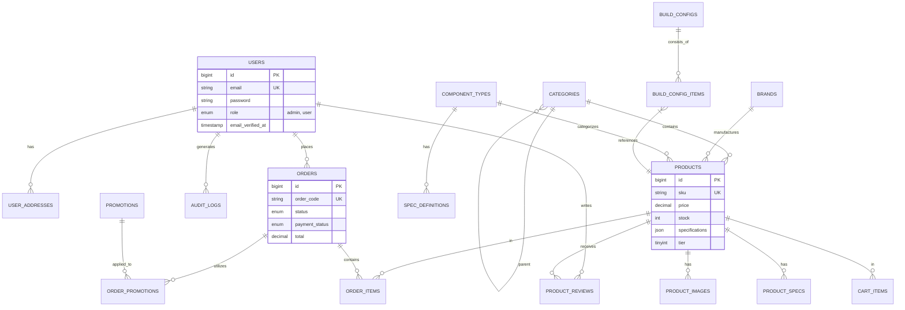
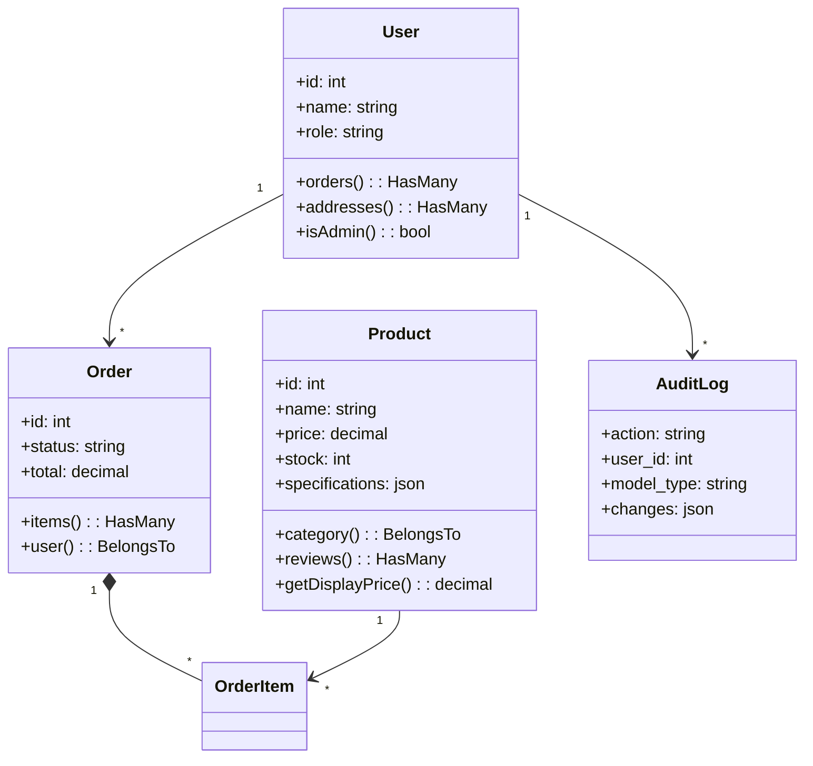
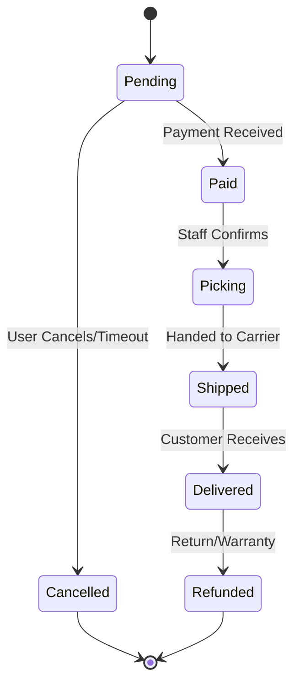
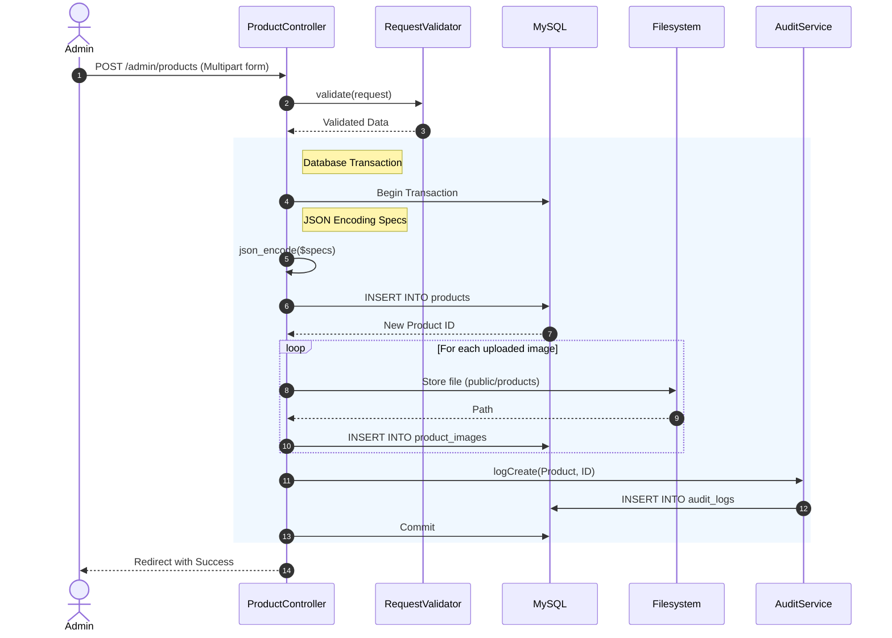

# Comprehensive System Design & Architecture Report

## 1. Executive Summary
The **PC Parts E-Store** is a specialized e-commerce platform designed for selling computer components and pre-built systems. The system features a custom "Build PC" wizard, sophisticated product filtering, audit logging for security, and a role-based administration panel. It is built on a monolithic Laravel architecture, containerized with Docker for reliability and consistency.

---

## 2. System Architecture

### 2.1 Architectural Pattern
The system adheres to the **Model-View-Controller (MVC)** architectural pattern, separating concerns into logical layers:

*   **Model (Data Layer)**: Represents the business entities (e.g., `Product`, `Order`). Uses **Eloquent ORM** for database abstraction, relationships, and mutators.
*   **View (Presentation Layer)**: Handles the User Interface using **Blade Templates**.
    *   **Frontend**: Utilizes **Tailwind CSS** for styling and **Alpine.js** for lightweight, reactive JavaScript interactions (e.g., cart updates, modal toggles).
    *   **Admin Panel**: Built with a "Cyber/Dark" theme aesthetic using the same stack.
*   **Controller (Application Layer)**: Handles incoming HTTP requests, executes business logic, and returns responses.
    *   **Separation**: Admin logic is isolated in `App\Http\Controllers\Admin` namespace to ensure security boundaries.

### 2.2 Directory Structure Analysis
The application follows standard Laravel 10 conventions with specific customizations:

```text
/app
├── Console             # Scheduled tasks (Artisan commands)
├── Exceptions          # Custom error handling logic
├── Http
│   ├── Controllers     # Request handlers
│   │   ├── Admin       # Admin-specific controllers (Product, Order, User)
│   │   └── Auth        # Authentication controllers (Login, Register)
│   ├── Middleware      # Request filtering (AdminMiddleware, Authenticate)
│   └── Requests        # Form validation classes
├── Models              # Eloquent entities (Product, User, Order)
├── Providers           # Service container binding (AppServiceProvider, AuthServiceProvider)
└── Services            # Business logic encapsulation (AuditService, CartService)
/database
├── migrations          # Database schema version control
└── seeders             # Initial data population
/resources
├── views               # Blade templates
│   ├── admin           # Admin dashboard views
│   ├── layouts         # Master layout files
│   └── pages           # Static content pages
└── css/js              # Asset source files (compiled via Vite)
/routes
├── web.php             # Main application routes
└── auth.php            # Authentication routes
```

### 2.3 Request Lifecycle
1.  **Entry Point**: Request hits Nginx, which forwards it to `public/index.php`.
2.  **Kernel**: `App\Http\Kernel` bootstraps the application and runs Global Middleware (CORS, Session Start).
3.  **Router**: Route is matched in `routes/web.php`.
    *   **Middleware**: specific middleware (e.g., `auth`, `admin`) validates the request.
4.  **Controller**: The matched method is executed.
    *   **Service Layer**: Controller may delegate complex logic to Services (e.g., `CartService`).
    *   **Model**: Controller interacts with database via Models.
5.  **Response**: Controller returns a View (HTML) or JSON response, which is sent back to the user.

---

## 3. Database Design

### 3.1 Entity-Relationship Diagram (ERD)



### 3.2 Data Dictionary (Table Specifications)

#### 1. `users`
| Column | Type | Attributes | Description |
| :--- | :--- | :--- | :--- |
| `id` | BIGINT | PK, AI | Unique User ID |
| `name` | VARCHAR(255) | Not Null | User's full name |
| `email` | VARCHAR(255) | UK, Not Null | Login email address |
| `password` | VARCHAR(255) | Not Null | Hashed password (Bcrypt) |
| `role` | VARCHAR(50) | Default 'user' | 'admin' or 'user' |
| `phone` | VARCHAR(20) | Nullable | Contact number |
| `birthday` | DATE | Nullable | User birth date |
| `gender` | ENUM | Nullable | 'male', 'female', 'other' |

#### 2. `products`
| Column | Type | Attributes | Description |
| :--- | :--- | :--- | :--- |
| `id` | BIGINT | PK, AI | Product ID |
| `category_id` | BIGINT | FK | Linked text category |
| `brand_id` | BIGINT | FK, Nullable | Manufacturer link |
| `component_type_id`| BIGINT | FK, Nullable | Technical classification for PC Builder |
| `name` | VARCHAR(255) | Not Null | Product display name |
| `slug` | VARCHAR(255) | UK | URL-friendly name |
| `sku` | VARCHAR(255) | UK | Stock Keeping Unit code |
| `price` | DECIMAL(12,2) | Not Null | Base selling price |
| `sale_price` | DECIMAL(12,2) | Nullable | Discounted price |
| `stock` | INT | Default 0 | Current inventory count |
| `specifications` | JSON | Nullable | Key-Value specs (e.g., {"CPU": "i7"}) |
| `tier` | TINYINT | Nullable | Performance tier (1-4) |
| `is_active` | BOOLEAN | Default 1 | Visibility toggle |

#### 3. `orders`
| Column | Type | Attributes | Description |
| :--- | :--- | :--- | :--- |
| `id` | BIGINT | PK, AI | Order ID |
| `user_id` | BIGINT | FK | Customer ID |
| `order_code` | VARCHAR(50) | UK | Readable ID (e.g., ORD-001) |
| `status` | ENUM | Default 'pending' | pending, paid, shipped, delivered, cancelled |
| `payment_status` | ENUM | Default 'pending' | pending, paid, failed, refunded |
| `subtotal` | DECIMAL | Not Null | Sum of items before tax/ship |
| `total` | DECIMAL | Not Null | Final charge amount |
| `shipping_name` | VARCHAR | Nullable | Recipient name (snapshot) |
| `shipping_address`| TEXT | Nullable | Full address (snapshot) |
| `placed_at` | TIMESTAMP | Nullable | Precise time of order placement |

#### 4. `order_items`
| Column | Type | Attributes | Description |
| :--- | :--- | :--- | :--- |
| `id` | BIGINT | PK, AI | Item ID |
| `order_id` | BIGINT | FK | Parent Order |
| `product_id` | BIGINT | FK | Product Reference |
| `price` | DECIMAL | Not Null | Price *at moment of purchase* |
| `qty` | INT | Not Null | Quantity purchased |

#### 5. `audit_logs`
| Column | Type | Attributes | Description |
| :--- | :--- | :--- | :--- |
| `id` | BIGINT | PK, AI | Log ID |
| `user_id` | BIGINT | FK, Nullable | Actor who performed action |
| `action` | VARCHAR(50) | Not Null | 'create', 'update', 'delete' |
| `model_type` | VARCHAR | Nullable | Class name (e.g., App\Models\Product) |
| `model_id` | BIGINT | Nullable | ID of affected record |
| `old_values` | JSON | Nullable | Data before change |
| `new_values` | JSON | Nullable | Data after change |

---

## 4. Behavioral & UML Diagrams

### 4.1 Use Case Diagram (Actors)
*   **Guest**: Browse Products, Add to Cart, Register.
*   **Registered User**: Save Addresses, Checkout, View Order History, Build PC, Review Products.
*   **Admin**: Manage Catalog (Products/Categories), View Audit Logs, Manage Orders (Update Status), Manage Users.

### 4.2 Class Diagram (Core Models)


### 4.3 Activity Diagram: Order Processing
Describes the lifecycle of an order from administration perspective.



### 4.4 Sequence Diagram: Admin Add Product
Describes the flow including image upload and audit logging.



---

## 5. Security & Infrastructure

### 5.1 Infrastructure
*   **Dockerized**: The entire stack runs in isolated containers defined in `docker-compose.yml`.
    *   `uitech-app`: Application logic (PHP-FPM).
    *   `uitech-db`: Data persistence (MySQL).
    *   `uitech-redis`: Session store and Cache.
    *   `uitech-phpmyadmin`: Database management tool.

### 5.2 Security Measures
1.  **Authentication**: Uses Laravel's built-in session-based auth.
    *   Passwords securely hashed using **Bcrypt**.
2.  **Authorization**:
    *   `AdminMiddleware` (`admin` alias): Protects `/admin` routes by checking `Auth::user()->role === 'admin'`.
    *   **Gates/Policies**: Granular resource access control.
3.  **Data Protection**:
    *   **CSRF Protection**: All POST/PUT/DELETE forms include `@csrf` token.
    *   **SQL Injection**: Prevented via Eloquent ORM parameter binding.
    *   **XSS**: Blade `{{ }}` syntax automatically escapes output.
4.  **Audit Trails**: Critical administrative actions are logged in `audit_logs` to ensure accountability.
